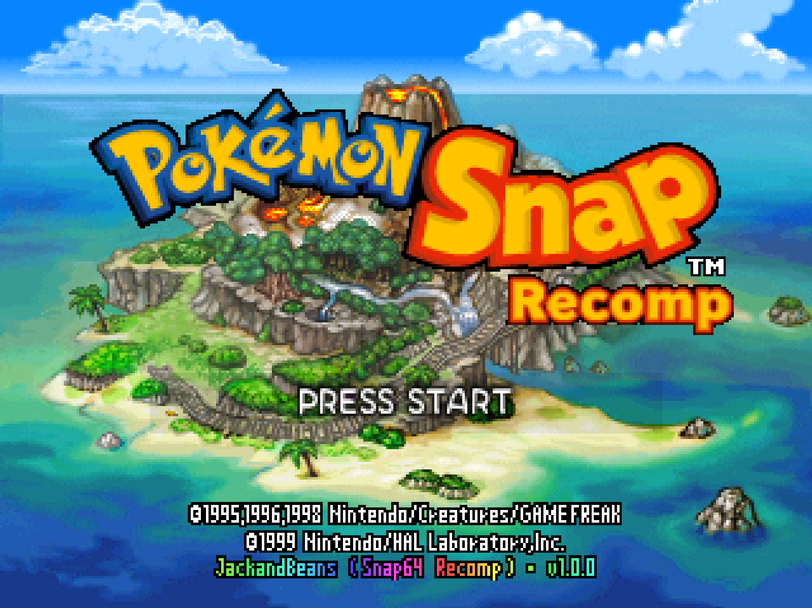
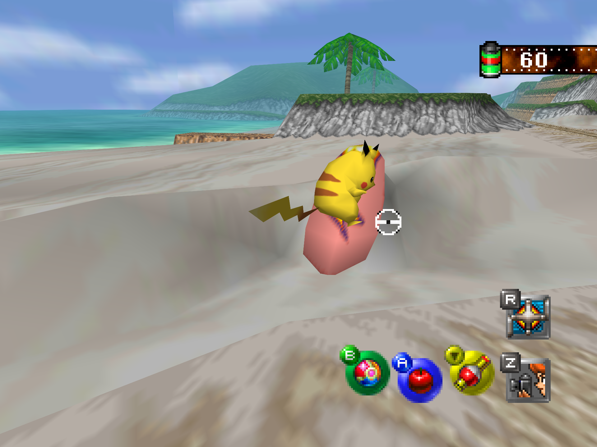
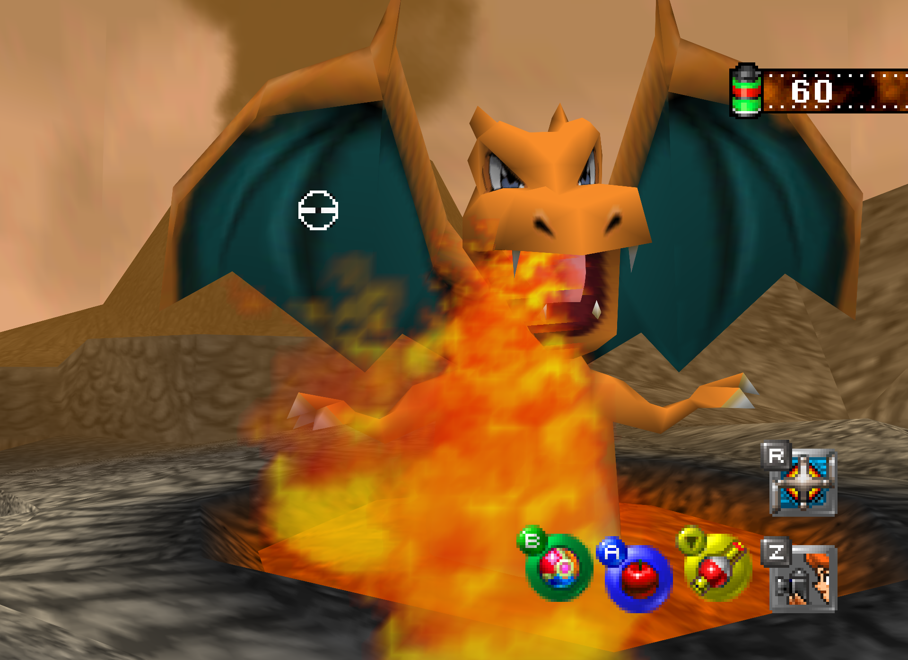
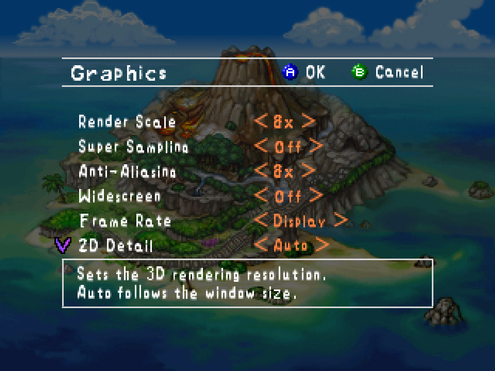
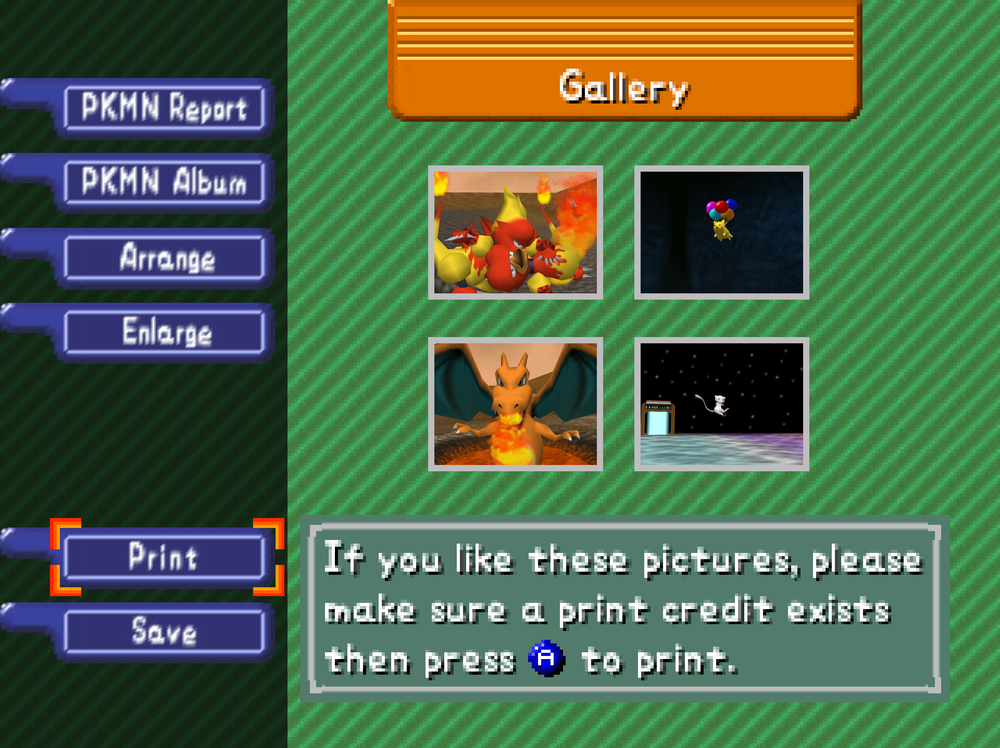
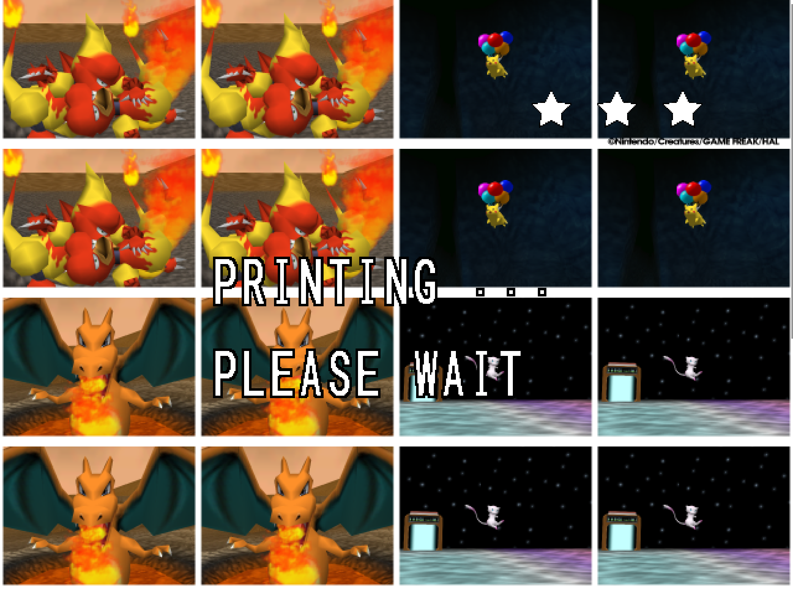

# Snap64 Recomp

By Jack & Beans. A native Windows port of the Nintendo 64 game *Pokémon Snap*
(US release), made by static recompilation.
[N64Recomp](https://github.com/N64Recomp/N64Recomp)
translates the game's MIPS code into C, [N64ModernRuntime](https://github.com/N64Recomp/N64ModernRuntime)
(`librecomp` + `ultramodern`) stands in for the console's operating system,
[RT64](https://github.com/rt64/rt64) renders, and SDL2 provides the window,
input and audio. The game's own code runs; the port changes how it is hosted,
and every change to how it *looks* is off unless you turn it on.

This project is not affiliated with, endorsed by or connected to Nintendo,
Creatures Inc., GAME FREAK inc., HAL Laboratory or The Pokémon Company;
Pokémon and Pokémon Snap are their trademarks, and the game is theirs. No
game data is included: you supply your own cartridge dump. The executable
does contain the game's code, translated from the builder's own dump into C
by N64Recomp and compiled, as every N64Recomp port does; `NOTICE.md` says
exactly what is derived from the game and how.

The title screen's credits line reads `JackandBeans (Snap64 Recomp) · v1.0.0`:
"JackandBeans" is the name the port's author goes by, after the HAL team
that made the game ("The game, and its history" below), "Snap64 Recomp" is
the port's name, and `1.0.0` is its version.
The people and projects this port stands on are thanked under
[Thanks](#thanks) below.

## Get it running

1. Download `Snap64Recomp-1.0.0-win64.zip` from the
   [Releases](../../releases/latest) page and unpack it anywhere.
2. Put your own dump of the US cartridge, named `pokemonsnap.z64`, next to
   `Snap64Recomp.exe` (its SHA-1 is under "What you need" below).
3. Start `Snap64Recomp.exe`. Windows 10 or 11, 64-bit, a GPU driver with
   Direct3D 12; nothing else to install. The first start compiles shaders and
   takes a little longer; if SmartScreen objects, "More info", then "Run
   anyway", once.

Keyboard and controller mappings are under "Controls"; the Graphics and
Sound pages are on the game's own Options screen; saves live in `saves/`
next to the executable, so keep that folder when you update.

## Screenshots

<table><tr>
<td></td>
<td></td>
</tr><tr>
<td></td>
<td></td>
</tr><tr>
<td></td>
<td></td>
</tr></table>

Taken from the 1.0.0 build at 1440p with Render Scale 8 and 8x anti-aliasing;
the rest (the title menu, the course select, the Tunnel, the lab, the Options
and Sound pages, the printer with its marks, Oak's check from the photo
choice to the score sheet, the Camera Check) are in `docs/screenshots/`.

## Status: 1.0.0

* Built and run on one machine: Windows 11, MSVC 2019, a Direct3D 12 GPU. No
  other platform, GPU or compiler has been tried; the first report from a
  different machine is welcome, good or bad.
* **Buildable from a clean checkout, in two steps beyond `git clone`.**
  `python tools/fetch_deps.py` fetches the vendored trees (SDL,
  DirectX-Headers, RT64's third-party trees) at the recorded upstream commits
  and verifies them; the recompiled game and the recompiler's inputs
  (`RecompiledFuncs/`, `RecompiledPatches/`, the ROM) are generated under WSL
  from your own cartridge dump. A second checkout built this way, on this
  machine, on 2026-09-02 (`BUILDING.md`, "What a clean checkout is missing").
* No CI and no installer. The release archive is the ZIP that `cpack`
  writes (`BUILDING.md`, step 13), after the headless suite in
  `tools/release_check.py` has passed on it ("What has been verified").
* Version `1.0.0`, typed once in `CMakeLists.txt` and shown in the title
  bar, the log banner, the credits line, the executable's file properties and
  the ZIP's name. `CHANGELOG.md` says what each release changed.
* Licensed under the GPLv3 (`LICENSE`); `NOTICE.md` lists every third-party
  component. No file in the tree carries the game's bytes: the menu font is
  cut from the game's own sprites in memory at run time, and the audio
  microcode is recompiled from the builder's ROM at build time (`NOTICE.md`,
  last section).

## What you need

* A 64-bit Windows 10 or 11 PC (the port asks Windows for per-monitor DPI
  awareness, which needs Windows 10 version 1703 or later). The executable
  imports `d3d12.dll`, `dxgi.dll` and `d3dcompiler_47.dll` from Windows, so
  the GPU driver must provide Direct3D 12; `vulkan-1.dll` is loaded only if
  you switch `graphics_api` to Vulkan. The Visual C++
  runtime is linked into the executable; nothing else has to be installed.
* **Your own dump of the US cartridge**, SHA-1
  `edc7c49cc568c045fe48be0d18011c30f393cbaf` (the checksum the
  [decompilation project](https://github.com/ethteck/pokemonsnap) publishes).
  Name it `pokemonsnap.z64` and put it next to `Snap64Recomp.exe` (the
  port reads its own folder, not the working directory; see "Where things
  live"). Byte-swapped `.v64` and little-endian
  `.n64` dumps are accepted -- the runtime detects the order from the header
  and corrects it in memory without touching the file -- but the file name is
  fixed, so rename such a dump to `pokemonsnap.z64`. A missing, unreadable or
  wrong-revision file produces a dialog before the window opens; a wrong dump
  shows both the expected and the actual hash. The ROM is never included
  with this project.
* Beside `Snap64Recomp.exe`: `SDL2.dll`, `dxcompiler.dll`, `dxil.dll` (the
  build places them there; `BUILDING.md`, step 12), and optionally
  `menu_text/recomp_logo.png` for the "Recomp" badge under the title logo (no
  file, no badge).

## Running

Start `Snap64Recomp.exe`; a shortcut works from anywhere, because the port
reads and writes the folder the executable is in, whatever the working
directory (`src/paths.cpp`). It opens a 1280x960 window titled
`Snap64 Recomp 1.0.0`; `SNAP_WINDOW=WxH` in the environment opens it at
an exact size instead (at least 320x240). The window's maximize button is the
fullscreen switch; the in-game Graphics page and F11 do the same. **Esc
quits.** Saves go to `saves/` and settings to `snapsettings.json`, both next
to the executable. No console opens: the log is `snap64.log` next to the
executable, the previous run's is kept as `snap64.prev.log`, and it is the
first thing to include in a bug report. Started from a terminal, or with its
output redirected, the port writes there instead and the file is not touched.
A second copy started while the first is running, from any folder, waits up
to 25 seconds for it to exit (the Snap Station relaunches itself that way)
and otherwise tells you the port is already running.

**If Windows or your antivirus objects.** The executable is not signed, so
the first start may bring up SmartScreen's "Windows protected your PC";
"More info", then "Run anyway", is the route, once. The Snap Station's Print
starts a fresh copy of the port twice in a row, which some antivirus
heuristics dislike; allow it if asked. Nothing here phones home: the port
opens no network connection at all.

**Back up your save.** `saves/pokemonsnap.bin` is the whole of your progress
in one file, with one earlier generation kept as `.bak`. Copy `saves/`
somewhere else before updating the port or trying a Snap Station print.

**Reporting a bug.** Open an issue at
`https://github.com/JackandBeans/Snap64Recomp/issues` (the repository this
README came from) and attach `snap64.log` from the run that went wrong,
`Snap64Recomp.map` if the log has `[SNAP-AV]` lines, your `snapsettings.json`,
and what you were doing. Say which GPU and driver you
have; every run so far has been on one machine. The issue form asks for
these; `CONTRIBUTING.md` has the ground rules for code.

### Where things live

Everything is in the folder with the executable.

| File or folder | What it is |
| --- | --- |
| `pokemonsnap.z64` | your ROM (you provide it) |
| `snapsettings.json`, `snapsettings.json.bak` | settings, written by the in-game Graphics and Sound pages and by the hotkeys |
| `saves/pokemonsnap.bin`, `saves/pokemonsnap.bin.bak` | the game's save data, one file (a raw image of the cartridge's save memory) |
| `photos/` | the photos you save with P or the controller's Back button (see "Photos"); created on the first save |
| `cache/` | RT64's compiled shaders, the driver's pipeline cache and the seen-shader list; safe to delete, the next start is slower |
| `snap64.log`, `snap64.prev.log` | the log of this run and of the one before it, written when the port was not started from a terminal |
| `mods/`, `mod_config/` | the runtime's mod folders; the loader runs at every start, no mod ships with this release, and there is no in-game mod manager (see "Mods and texture packs") |
| `texture_packs/` | HD texture packs you install yourself, scanned once at start-up; created empty, none ships with this port (see "Mods and texture packs") |
| `stickers/` | the sticker sheets the Snap Station prints (see "The Snap Station"); created on the first print |
| `menu_text/recomp_logo.png` | the "Recomp" wordmark on the title screen |
| `SDL2.dll`, `dxcompiler.dll`, `dxil.dll` | the window, input and audio library, and the shader compiler and validator the renderer needs; leave them beside the executable |
| `Snap64Recomp.map` | the linker map; include it with crash reports (the `[SNAP-AV]` lines in the log are decoded against it) |
| `LICENSE`, `NOTICE.md`, `licenses/` | licences |

Coming from an earlier build: settings, saves and the ROM were already next to
the executable and carry over as they are. Earlier builds kept the shader cache
in `%LOCALAPPDATA%\pokemonsnap`; that folder is no longer read and can be
deleted. The first start after the change rebuilds the cache once.

### Controls

Keyboard (`src/input.cpp`):

| N64 | Key |
| --- | --- |
| Control stick | W A S D |
| A / B | X / Z |
| Z | Left Shift |
| Start | Enter |
| D-pad | Arrow keys |
| L / R | Q / E |
| C-Up / C-Down / C-Left / C-Right | I / K / J / L |

The keys are fixed scancodes, positional on the keyboard: on a non-QWERTY
layout they are the keys in those places, not the letters printed on them.

Any SDL game controller overrides the keyboard while attached: left stick is
the control stick, A is A, B or X is B, the left shoulder button is Z, Start
is Start, the D-pad is the D-pad, the triggers are L and R, and the right stick
is the C buttons. The Back button (Select, View or Share on most pads) is not
an N64 button: it saves the photo on screen, as P does on the keyboard (see
"Photos"). The first pad SDL recognises is the one used; a pad SDL has no
mapping for is logged as such at start-up (`[SNAP-Input]`) and can be given
one through SDL's `SDL_GAMECONTROLLERCONFIG` environment variable.

### The rule the port follows

**Console behaviour by default; every enhancement is opt-in.** Frame rate,
aspect ratio, anti-aliasing, overscan, the intro's camera hand-off, texture
filtering, dithering: all start as the console had them. What you turn on in
the in-game **Graphics** page (a new item on the game's own Options screen) or
with the hotkeys is what changes, and only that. Three defaults are worth
knowing about because they are not literally the console's: the 3D render
resolution follows the window (`resolution_scale` 0; set 1 for 320x240), 2D
content that would be scaled anyway is drawn sharp (`upscale_2d` 1; set 0
for the original pixels), and the finished frame is put on screen with
RT64's anti-aliased pixel scaling rather than raw nearest pixels
(`present_filter` 2; set 0 for the blocks). Each is one setting away from
the original.

Two mechanics depend on the game reading back its own rendered frame: photo
scoring re-renders the photographed Pokémon and counts pixels, and the
viewfinder's red focus dot is found by copying tiles of the colour buffer.
Frame interpolation (Frame Rate set to Display or Manual) presents frames the
game never drew; the window title says `interpolation ON (F8)` while it is on.
Colours the game steps once per frame are blended too: the fade to black
between screens is a full-screen quad whose alpha the game moves per tick,
and a draw matched to its previous frame's blends that colour between the
two, so the fade moves at the display's rate like everything behind it.
Photo scoring was measured working with it on (five photos, the game's own
pixel counts reproduced exactly), because the readback uses the frames the
game draws, not the synthetic ones between them. The focus dot under
interpolation has not been re-measured and should be treated as unverified.
Original is the default because it is the console's rate.

### In-game pages

Options > **Graphics**, in the order the page shows them: Render Scale,
Super Sampling, Anti-Aliasing, Widescreen, Frame Rate, 2D Detail, Filter,
Texture Filter, Color Depth, Buffering, Dither, Fullscreen, Overscan Crop,
Cutscene Fix, Photo Detail, Jynx Recolor. Color Depth and Buffering take
effect after a restart; everything else applies while the page is open. The
page's Frame Rate row switches between Original and Display; the Manual
mode (`fps_mode` 2) is reached with F8 or the settings file, and the page
leaves it alone.

Options > **Sound**: Master Volume, Music Volume, Sound Effects, Shutter
Volume, Speaker Output (Stereo/Mono), Background Mute.

### Hotkeys

From `handle_settings_hotkey` in `src/settings.cpp` (Esc is `src/main.cpp`'s).
Settings hotkeys also mark the file for writing. Keys marked *diagnostic*
exist for investigating the renderer and are not features.

| Key | Effect |
| --- | --- |
| F11 | Fullscreen on/off |
| F10 | Widescreen on/off |
| F9 | Anti-aliasing: off, 2x, 4x, 8x, off |
| F8 | Frame Rate mode: Original, Display, Manual |
| F7 | Speaker output: stereo/mono |
| F5 | Write `snapsettings.json` now |
| F4 | Camera interpolation on/off (see `src/settings.h` for why it is on) |
| F3 | *diagnostic* Ubershaders only |
| F2 | Overscan Crop on/off |
| F1 | *diagnostic* Frame holds inside a course |
| F6 | *diagnostic* Render-to-RAM on/off; inert unless started with `SNAP_STATS=1`, never saved |
| F12 | *diagnostic* Mark the moment in the statistics log (needs `SNAP_STATS=1`) |
| Home | *diagnostic* 2D rectangle interpolation on/off |
| End | *diagnostic* Effect-sprite naming on/off |
| P | Save the photo on screen as a PNG in `photos/` (see "Photos") |
| Esc | Quit |

### Photos

Every photo the game shows you -- the picks after a course, Oak's check, the
album, the report -- is drawn the same way: the game rebuilds the photo's saved
state as objects and renders them once into a 320x210 buffer in memory (the
size it asks for varies by screen, up to that), then shows that buffer as a
sprite. With render-to-RAM on, which it is unless you turn it off, the rendered
pixels are written back into that buffer, which is what lets the game score
photos at all. **P**, or the controller's **Back** button, saves that buffer's
rendered region as a PNG: the photo at the game's own resolution, pixel for
pixel, with no scaling, no frame and no text over it. Files go to `photos/`
next to the executable, named `snap_YYYYMMDD_HHMMSS_<course>_NN.png` (the
course is left out if the game's own record of it cannot be read), and the log
prints `[SNAP] photo saved: <path>` or the reason it was not: no photo has been
rendered yet, no photo is on screen, or render-to-RAM is off. Nintendo's 2007
Wii Virtual Console release added the same thing -- Select in the album posted
the photo on screen to the Wii Message Board -- so this is an enhancement with
a precedent, and one that draws nothing on screen. The code is
`src/photo_export.cpp`.

### The Snap Station

The Pokémon Snap Station was the Blockbuster Video kiosk of 1999 (Lawson
stores in Japan) that printed a player's photos as a sheet of sixteen
stickers. Inside it a Nintendo 64 with the Expansion Pak ran the ordinary
retail cartridge, and the printer sat on controller port 4, where the game
speaks to it as if it were a Controller Pak; every retail cartridge carries
the code, and the protocol was recovered without a station by James Chambers
in 2021 and matches the decompilation line for line. The port emulates the
device on port 4.

It is reached from the title screen. Once the saved report holds more than
three species, the game adds its Gallery entry to the title menu, and the
port adds a fifth entry below it, **Snap Station**, drawn in the title's
own lettering. Choosing it attaches the station to port 4 for this run and
opens the game's own Gallery, exactly as the Gallery entry does; nothing is
written to the settings. (The console at home had no station, so port 4
is empty otherwise; `"snap_station": true` in `snapsettings.json` keeps it
attached on every start instead, from the moment the title menu is up: the
game tests port 4 for the printer once at boot and would go straight to the
printer's display if it found one, so the station appears after that test.)

In the Gallery with the station attached, the game shows the Print button
the kiosk showed, above Save, with the game's own help text about a print
credit. Print does what it did in
the store: the game saves the four photos of its print tray to the
cartridge (the tray is the Arrange screen's four cells, which the Camera
Check fills with the photos Oak accepts), asks the station to reset the
console, and the port relaunches itself. The relaunched game finds the
station present at boot, tests the Expansion Pak memory as the kiosk
firmware required, and runs its photo display mode: a 640x480 screen that
draws the sixteen sticker slots one after another, each of the four photos
in a 2x2 block of a 4x4 sheet, the layout being the game's own table. The
kiosk's printer captured the video output at each slot; the port captures
the framebuffer the video interface is scanning out, which is the same
picture, and the renderer's presented frame beside it. Each slot is the
game's own composition: a white card and the photo filling it but for a
hem; on the fourth slot alone the game draws its black rights line along
the bottom, for no reason any source explains. When the display
ends the sixteen captures are laid out into `stickers/<date>/sheet.png`
(and `sheet_presented.png` from the renderer's frames, with the sixteen
singles in `slots/`). The kiosk's printer had a screen of its own, laid over the
video: after each slot it showed the sticker grid it had collected so far,
and after the last one that grid under "PRINTING... PLEASE WAIT" with three
marks that became stars one by one as its three passes finished. The port
shows the same, composed from its captures (the grid is kept as
`printer_display.png`); the pass times are an estimate, the footage this was
taken from (Leonhart's recording of a working kiosk, "Thanks" below) having
no clock. Then the port relaunches itself once more into a
normal boot, as the kiosk reset the console a second time. That boot opens
the sheet's folder for you, the way the kiosk handed over the stickers; the
station is not attached to it, so the title is the ordinary one until you
choose Snap Station again. Both relaunches come back fullscreen if the
print was started fullscreen. The lettering on that screen is set from
bitmaps of Roboto Regular (Apache License 2.0), a freely licensed grotesque
of the same construction as the printer's own, which cannot be read off a
recording of a curved screen; `tools/osd_font_gen.py` regenerates them.

What the sheet cannot be: the physical stickers were postage-stamp-sized
prints of a captured analog video signal on a photo printer whose make,
media size and colour processing the public sources do not agree on, so the
files are the pixels the game sent at their native size and the layout the
game defined, not a scan of a Blockbuster sheet. Nothing of the kiosk ships
with the port; every pixel on the sheet is the player's own photo drawn by
the game from the player's own save.

### Mods and texture packs

Two loaders are compiled in, and both run on every start; neither has any
content attached. The runtime this port is built on scans `mods/` for `.nrm`
mod containers, the format the other N64 recompilation projects use, and
loads the ones enabled in `mod_config/mods.json`; a mod must target the game
id `pokemonsnap`, and there is no in-game manager, so `mods.json` is the
whole of the control. The renderer scans `texture_packs/` for RT64
replacement packs, a `.rtz` archive or a folder carrying an `rt64.json`,
loads them in alphabetical order with later packs winning, and does it once
at start-up, so the folder's contents are the switch. `README` files in both
folders say the same.

Nothing is bundled and nothing is curated. No texture pack exists for this
game in RT64's format today, and no mod community exists for it, so the
port links the format's specification rather than a list: RT64's
`TEXTURE-PACKS.md`, and the `texture_hasher` and `texture_packer` tools in
`lib/rt64/src/tools/`. Making a pack needs RT64's developer mode to dump
the textures a pack is keyed on; `SNAP_DEV=1` in the environment turns it
on for a launch. RT64 then takes F1 to F4 for its own panels, so Overscan
Crop's F2 and camera interpolation's F4 belong to it until the next launch.

The one-ROM rule: this port transforms the one cartridge you supply, and
that is the whole of it. Assets taken from another game's data, models from
another title, or a pack made from them are not something this project will
host, link, or help install.

### Settings file

`snapsettings.json` is written about 750 ms after the last change (so a slider
costs one write), and on exit if anything is unsaved; the previous file is
kept as `snapsettings.json.bak` and read if the main file is missing or does
not parse. Keys are the field names of `struct Settings` in `src/settings.h`;
the defaults below are that file's.

| Key | Default | Meaning |
| --- | --- | --- |
| `fullscreen` | `false` | not persisted across runs: every boot starts windowed, except that the Snap Station's own relaunches return in the state the print started in |
| `widescreen` | `false` | RT64 Expand: a true 16:9 field of view, not a stretch |
| `msaa` | `0` | 0, 2, 4 or 8 |
| `fps_mode` | `0` | 0 Original, 1 Display refresh, 2 Manual (`fps_manual_target`) |
| `fps_manual_target` | `120` | |
| `stereo` | `true` | the game's own Stereo/Mono flag (`hq_sound` is read as a legacy name) |
| `master_volume`, `music_volume`, `sfx_volume`, `shutter_volume` | `100` | percent, in steps of ten |
| `mute_unfocused` | `false` | silence while another window has focus |
| `three_point_filtering` | `true` | the console's texture filter (Texture Filter: Authentic) |
| `crop_enabled` | `false` | Overscan Crop |
| `crop_left`, `crop_right`, `crop_top`, `crop_bottom` | `16`, `16`, `12`, `12` | pixels hidden per side when the crop is on |
| `intro_fix` | `false` | Cutscene Fix: skips the one frame the console drew from inside the player model at the end of the Beach and River intros |
| `photo_detail` | `false` | Photo Detail: Off draws Oak's photos and the album at native pixels as the console did; On serves them from the renderer's full-resolution render |
| `jynx_vc` | `false` | Jynx Recolor, Jynx's face and hands: Off: the cartridge's black; On: the purple of the re-releases, matched to a published Virtual Console screenshot |
| `interpolate_camera` | `true` | interpolate the view as well as objects (F4; no row on the Graphics page) |
| `snap_station` | `false` | keep the Snap Station on port 4 from the title menu on, every start (see "The Snap Station") |
| `graphics_api` | `0` | 0 Direct3D 12 (every run so far), 1 Vulkan (RT64's other backend, untried here; an escape hatch if D3D12 fails); restart |
| `downsample` | `1` | Super Sampling factor |
| `resolution_scale` | `0` | 0 follows the window; 1-8 caps the render scale in multiples of 320x240 |
| `present_filter` | `2` | 0 nearest, 1 linear, 2 RT64's anti-aliased pixel scaling |
| `upscale_2d` | `1` | 0 original pixels, 1 only content that scales anyway, 2 everything sharp |
| `dither_noise` | `true` | the console's post-blend dither |
| `color_depth` | `0` | 0 RT64 decides, 1 console-accurate 8-bit, 2 high precision; restart |
| `triple_buffering` | `false` | restart |
| `ubershaders_only` | `false` | diagnostic |

`render_to_ram` is never read from or written to the file.

Environment variables the executable reads: `SNAP_WINDOW` (window size),
`SNAP_STATS` (statistics and the diagnostic keys), `SNAP_MUTE`, `SNAP_RECORD`
and `SNAP_REPLAY` (input recording and replay), the `SNAP_PCAP_*` family
(presented-frame capture; `SNAP_PCAP_ATFRAME` keys captures to game frames,
which do not drift between runs the way input readings do),
`SNAP_PHOTO_AUTOEXPORT` (with `SNAP_STATS`: every photo the game renders is
saved to `photos/` without a key press, so a replay can prove the export),
`SNAP_ZDUMP_EVERY` and `SNAP_ZDUMP_START` (with `SNAP_STATS`: the game's
z-buffer dumped from memory on a reading schedule), `SNAP_FX_TAGS=0` (the
effect system's rectangles left unnamed), `SNAP_DEV` (RT64's developer
mode, "Mods and texture packs") and `SNAP_MENU_FONT_DUMP` (the harvested
menu font written out). They are development switches; the source is their
documentation.

## Known limitations

* Some 2D content is drawn without a name the interpolation can pair
  (the photo panels, Oak's thumbnails and full-screen backgrounds while they
  slide during a transition) and steps at the game's rate when it moves;
  named sprites and menu frames, the HUD and the fades interpolate.
* The Snap Station's printer lettering is set from a typeface of the same
  construction as the printer's, whose own character set no source records,
  and its pass timings are estimates from footage without a clock.
* Vulkan (`graphics_api` 1) is compiled in but has never been run by the
  developer; it exists for a machine whose Direct3D 12 path fails.
* Keyboard bindings cannot be remapped.
* With Overscan Crop off, the whole 320x240 frame is on screen, including
  the columns and rows a television hid, and some of the game's own art has
  edges there: the lab backdrop's leftmost pixel column and top row are
  pale in the picture itself, so a thin light strip shows at the left of the
  lab's translucent panel. The console drew the same pixels (verified
  against the picture as the game holds it in memory); Overscan Crop (F2)
  is the television's view.

## What has been verified, and what has not

* Verified in the sense that the developer has played every course, the
  report, the album, the Gallery and a Snap Station print on the one
  machine above, and the renderer, audio, saving, the Graphics and Sound
  pages and the hotkeys listed here all come from the code as it stands
  (`src/settings.cpp`, `src/settings.h`, `src/input.cpp`, `src/main.cpp`).
* `tools/release_check.py` is the headless suite a release build is put
  through: the executable is windowed, the log reaches a pipe or `snap64.log`,
  the Beach replay runs under the player's own conditions with captured
  frames that are real pictures, the diagnostic replay produces its usual
  pacing and coherence numbers with no crash report, the recorded run to
  Oak's evaluation scores every photo with the scorer's healthy signature and
  exports the photos it shows, the settings file is valid, and the archive
  carries everything it must; `--only station` puts the Snap Station print
  through both relaunches and checks the sheets. Both passed on the 1.0.0
  build. It opens the game window for each run and takes about twelve
  minutes, plus eight for the station. There is no CI run, and no build on
  any other machine is recorded in this repository. Anything not listed
  here should be assumed untried.
* The photo export (P, the controller's Back button, `photos/`) is checked
  by `SNAP_PHOTO_AUTOEXPORT` on an input replay that reaches Oak's check,
  not by hand: saving from the keyboard and from the controller has not been
  tried.
* The recompiled game is generated from a specific decompilation build; the
  chain of tools and inputs is spelled out in `BUILDING.md`, including one
  stale input on the developer's machine that must be regenerated before the
  recompiled code is.

## Building

See `BUILDING.md`. Short version: the decompilation and IDO under WSL,
N64Recomp for the game and the patches, CMake and MSVC on Windows, and a list
of things git does not carry. `cpack -C Release` in the build directory then
writes `Snap64Recomp-1.0.0-win64.zip` (step 13).

## The game, and its history

Pokémon Snap was made at HAL Laboratory with Pax Softnica and published by
Nintendo: Japan on 21 March 1999, North America that summer, Europe on 15
September 2000. It did not begin as a Pokémon game. It began as a
photography game called *Jack and the Beanstalk*, planned for the 64DD disk
drive, and the HAL team that made it was called **Jack and Beans**; Satoru
Iwata, then at HAL and later Nintendo's president, recalled that it
"wasn't a Pokémon game, but rather a normal game in which you took
photos". The 64DD version was dropped in January 1999 and the game shipped
on a cartridge, which still carries the team's unused "JACK AND BEANS"
prototype logo in the title screen's data. That is the name the port's
author took, and why. Yoichi Yamamoto directed, with Koji Inokuchi and
Akira Takeshima; Iwata and Shigeru Miyamoto produced. It sold more than
1.5 million copies by the end of 1999.

Two things about the original release shaped this port. In 1999 Nintendo
put Pokémon Snap Station kiosks into Blockbuster Video stores in the United
States and Lawson convenience stores in Japan: a Nintendo 64 with the
retail cartridge and a sticker printer on controller port 4, so a player
could bring a save in and leave with a sheet of sixteen stickers of their
own photos. The cartridge's code for that printer was recovered without a
station by James Chambers in 2021 and matches the decompilation, and the
port emulates the device ("The Snap Station" above). And when Nintendo
re-released the game on the Wii's Virtual Console in December 2007 (Wii U
in 2016 and 2017, Nintendo Switch Online in June 2022), it replaced the
kiosk with posting photos to the Wii Message Board, and recoloured Jynx
from black to purple as it had in the other early Pokémon games; the
port's photo export and Jynx Recolor options are those two changes,
reproduced and off by default.

The port could not exist without the
[decompilation](https://github.com/ethteck/pokemonsnap), the community's
years of work turning the cartridge back into readable C, which is where
every statement about the game's own behaviour in this README was checked.

Sources: [Wikipedia](https://en.wikipedia.org/wiki/Pok%C3%A9mon_Snap),
[Nintendo World Report, "Know Your Nintendo Developers: Pokémon
Snap"](http://www.nintendoworldreport.com/feature/43893/know-your-nintendo-developers-pokemon-snap),
[Serebii, Virtual Console changes](https://www.serebii.net/snap/virtualconsole.shtml),
[jamchamb, "Pokémon Snap Station" (2021)](https://jamchamb.net/2021/08/17/snap-station.html).

## How it was made

Two answers, because the question has two parts.

**What the port is, mechanically.** N64Recomp reads the game's code out of
the builder's own cartridge dump and writes it out as C, one function at a
time, at build time; none of that output is in this repository. That C is
compiled and linked with librecomp and ultramodern, which give it the
console's operating system calls, with RT64, which turns the game's display
lists into Direct3D 12, and with the port's own code under `src/`: the
window, input, audio and settings, the identity the frame interpolation
pairs objects and sprites by, the menu pages composed from the game's own
sprite font, the photo export and the Snap Station. Where the game's own
behaviour had to change for a feature (the Graphics page on its Options
screen, the fifth title entry, the intro's camera fix), the changed function
is a copy of its decompiled source under `patches/src`, compiled with the
decompilation's own IDO toolchain and loaded over the original. The whole
chain, with the tools and inputs at each step, is `BUILDING.md`.

**Who wrote it.** One person, not a team. Jack & Beans is an individual
with no studio, no collaborators and no funding behind this, who directed
the work from the first commit on 17 August 2026 to this release: set the
rule the port follows (console behaviour by default), chose what it would
and would not do, tested every build on screen, and found the reference
material the work needed: Leonhart's recording of a working kiosk, which the
printer's display was measured against; a published Virtual Console
screenshot, found through an image search, that the Jynx colour was matched
from; and the renders the logo was composed from. "The developer" elsewhere
in this README is that person; no model played the game.

Every line of the port's own code, its tools and its documentation, this
README included, was written by Anthropic's Claude models running in Claude
Code under that direction. The models were Claude Fable 5.1 and Claude
Fable 5, with Claude Opus 5 for a large share of the commits and two
commits by Claude Opus 4.8; the author also used Claude Sonnet 5 in some
sessions, and no commit names it. A commit's trailer names the model that
wrote it (`git log --format=%(trailers:key=Co-Authored-By)`); forty-six
commits between 18 and 24 August 2026 carry none, from sessions before the
rule was kept every time. Fable
5.1, the newest of them, carried the release work: the Snap Station from
the decompiled protocol to the printer's display, the renderer's
frame-pacing and identity work, and the audit and packaging of this
release.

What that meant in practice, which is the honest measure of what these
models can do when someone directs and checks them: holding the
decompilation, the runtime and RT64's source in view at once and changing
one without breaking the others; finding the game's own behaviour in its
code before deciding whether a difference was the port's (the intro's
off-by-one frame, the lab picture's pale edge, the station's boot-time
printer test); measuring instead of eyeballing (frames compared pixel by
pixel against the picture in the game's memory, the kiosk's lettering
measured from frames of a recording of a real screen); building their own
verification (the headless suite that replays controller recordings
through the real executable and reads back its log and captured frames);
and writing down every finding, measurement, dead end and revert in the
commit messages, which are the project's real notebook. What they cannot
do is see the screen or hold a controller: every judgement of how a thing
looks or feels was the author's, made on one machine, and the port has not
yet run on any other.

None of this asks to be taken on trust. The code is here, the commit
history is here with its reasoning, the notes under `docs/dev/` are the
models' reports to the author kept as written, and the suite's replays
are tracked so its checks can be re-run. `git log --stat` and an afternoon
of reading is the way to judge the job Claude did.

## Thanks

None of this would exist without:

* The [Pokémon Snap decompilation](https://github.com/ethteck/pokemonsnap)
  and everyone who worked on it: the port's patches are compiled against
  its headers and symbols, and every fact about the game's code in this
  README was read there.
* [N64Recomp](https://github.com/N64Recomp/N64Recomp) and
  [N64ModernRuntime](https://github.com/N64Recomp/N64ModernRuntime) by
  Wiseguy and contributors, the recompiler and runtime this port stands on,
  and the [Zelda64Recomp](https://github.com/Zelda64Recomp/Zelda64Recomp)
  project whose structure it follows.
* [RT64](https://github.com/rt64/rt64) by Dario and contributors, the
  renderer, and its frame interpolation this port extends.
* James Chambers (jamchamb), whose 2021 work recovered the Snap Station
  protocol from the cartridge without a station to test against.
* Leonhart, whose [recording of a working Snap Station
  kiosk](https://youtu.be/lCnvpIEVpqo) is the only picture this port had of
  the printer's own display: its sticker grid, its marks and stars, and the
  pace of its three passes were all measured from those frames.
* [ido-static-recomp](https://github.com/decompals/ido-static-recomp)
  by the decompals, which lets the decompilation's compiler, and so the
  port's patches, build on a modern machine.
* [SDL2](https://libsdl.org), the DirectX Shader Compiler, and the libraries
  named in `NOTICE.md`.
* The Roboto Project Authors, for the typeface the printer's lettering is
  set from.
* Anthropic's Claude, which wrote the port ("How it was made" above).
* The team at HAL Laboratory who made the game in 1999, and whose unused
  "JACK AND BEANS" prototype logo, still inside the cartridge, gave the
  port's author a name.
* Everyone who plays it and reports what they see: the first reports from
  other machines are what 1.0.1 will be made of.

## License

Copyright (C) 2026 Jack & Beans. GPLv3: see `LICENSE` and `NOTICE.md`. The port's own code is the author's
and GPLv3; the game is Nintendo's, Creatures', GAME FREAK's and HAL's, and
nothing of it is here.
