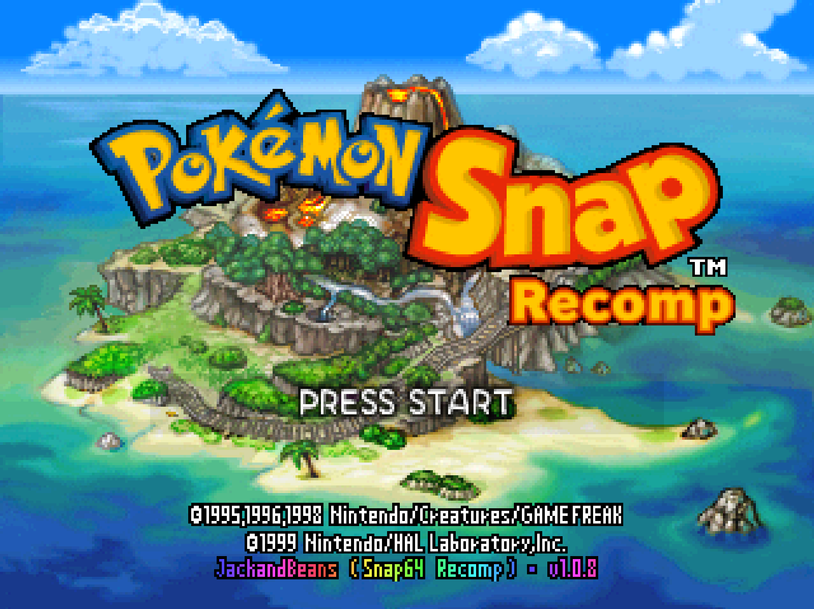

# Snap64 Recomp

Pokémon Snap, running natively on Windows and Linux. This is my port of
the Nintendo 64 game (US release), made by static recompilation: the
game's own code, translated to C and compiled for the PC, with your own
cartridge dump for its data. Out of the box it plays like the cartridge.
What I have added -- widescreen, higher frame rates, mouse and gyro aim,
rebinding, fast forward, photo export, the Snap Station's printer, a Steam
Deck build -- is off until you turn it on, from a row on the game's own
Options screen.

Underneath, [N64Recomp](https://github.com/N64Recomp/N64Recomp) translates
the game's MIPS code into C,
[N64ModernRuntime](https://github.com/N64Recomp/N64ModernRuntime)
(`librecomp` + `ultramodern`) stands in for the console's operating system,
[RT64](https://github.com/rt64/rt64) renders, and SDL2 provides the window,
input and audio. The game's own code runs; the port changes how it is
hosted.

This project is not affiliated with, endorsed by or connected to Nintendo,
Creatures Inc., GAME FREAK inc., HAL Laboratory or The Pokémon Company;
Pokémon and Pokémon Snap are their trademarks, and the game is theirs. No
game data is included: you supply your own cartridge dump. The executable
does contain the game's code, translated from my own dump into C by
N64Recomp and compiled, as every N64Recomp port does; `NOTICE.md` says
exactly what is derived from the game and how.

The credits line on the title screen, `JackandBeans (Snap64 Recomp) · v1.0.8`,
is my name, the port's name and its version. The name is the HAL team's
that made the game ([the game's history](docs/HISTORY.md)); the people and
projects this port stands on are under [Thanks](#thanks).

**Contents:** [Get it running](#get-it-running) ·
[Screenshots](#screenshots) · [What the port adds](#what-the-port-adds) ·
[What you need](#what-you-need) ·
[The rule the port follows](#the-rule-the-port-follows) ·
[Controls](#controls) · [Linux and Steam Deck](#linux-and-steam-deck) ·
[The headset](#the-headset) · [Known limitations](#known-limitations) ·
[What's next](#whats-next) · [Reporting a bug](#reporting-a-bug) ·
[What has been verified](#what-has-been-verified) ·
[Building](#building) · [How I made it](#how-i-made-it) ·
[Thanks](#thanks) · [License](#license)

The full documentation is under `docs/`: [the manual](docs/MANUAL.md)
(every control, page, hotkey and setting), [the Snap
Station](docs/SNAP-STATION.md), [Linux and the Steam Deck](docs/STEAM-DECK.md),
[the headset](docs/VR.md), [what has been verified](docs/VERIFICATION.md),
[the game's history](docs/HISTORY.md) and [the screenshots](docs/SCREENSHOTS.md).

## Get it running

> **In a hurry?** The archive holds a `START HERE.txt` with the short version.
> The one part people miss: this port has no launcher and no
> overlay, so everything it adds lives inside the game's own **Options**
> screen. Options > Graphics is where widescreen, the frame rate and the rest
> of the enhancements are, and they all start off, set to what the console
> did.

You need a 64-bit Windows 10 or 11 PC whose graphics driver provides
Direct3D 12, and your own dump of the US cartridge; nothing has to be
installed. Then:

1. Download `Snap64Recomp-1.0.8-win64.zip` from the
   [Releases](https://github.com/JackandBeans/Snap64Recomp/releases/latest)
   page and unpack it anywhere; it holds one folder,
   `Snap64Recomp-1.0.8-win64`, with `Snap64Recomp.exe` inside.
2. Have your own dump of the US cartridge to hand (the ROM: the cartridge's
   contents read out into one file). Either put it next to
   `Snap64Recomp.exe` named `pokemonsnap.z64`, or just start the program:
   with no ROM beside it, it asks for the file, checks it, copies it there
   under that name, and never asks again. You do not have to check the file
   yourself: a wrong one is refused with the expected and the actual
   checksum (a 64-bit hash of the file, not the SHA-1 under "What you
   need").
3. Start `Snap64Recomp.exe`. Because the executable is not signed, Windows
   may first show a "Windows protected your PC" box (SmartScreen): click
   "More info", then "Run anyway", and it will not ask again. The first start
   then takes a little longer than later ones while the renderer builds the
   shader programs your GPU needs; they are kept in `cache/`, so the next
   start is quick.

The window's maximize button switches to fullscreen and F11 switches it
back, in a course or anywhere else. **Esc is the pause menu** in a course
(Continue, Retry, Quit course) and Start elsewhere. To quit the program,
choose **Exit Game**, the last row of the game's Options screen (A asks,
a second A closes, B stays), or **hold Esc for a second and let go**: a
box asks, and Enter or Esc keeps you playing, so a hand resting on the key
cannot end a run. Keyboard and
controller mappings are under
[Controls](#controls); the Graphics and Sound pages are on the game's own
Options screen, reached from the title menu ([In-game
pages](docs/MANUAL.md#in-game-pages)); saves live in `saves/` next to the executable, so
keep that folder when you update. If something goes wrong, the paragraphs
under [Running](docs/MANUAL.md#running) say what Windows or an antivirus may object to
and what to attach to a bug report.

## Screenshots

<table><tr>
<td></td>
<td></td>
</tr><tr>
<td></td>
<td></td>
</tr><tr>
<td></td>
<td></td>
</tr><tr>
<td></td>
<td></td>
</tr></table>

Every picture is the port's own render at 1440p with Render Scale and
Anti-Aliasing both at 8x on the Graphics page, cropped to the game's
picture; each caption names the release it was taken from. Every one of them,
with a caption (the title and its menu, the courses, the lab, every
page of the Options screen including Button Setup, the printer's marks,
Oak's check from the photo choice to the score sheet, the Camera Check and
the Beach in Widescreen), are in [docs/SCREENSHOTS.md](docs/SCREENSHOTS.md).

## What the port adds

Every one of these is a row on the game's own Options screen or a key, and
every one starts off or at the console's setting. [The manual](docs/MANUAL.md)
has each in full.

* **The Graphics page**, a new item on the game's Options screen, drawn in
  the game's own font: Render Scale, Super Sampling, Anti-Aliasing up to
  8x, Widescreen, Frame Rate, 2D Detail, Filter, Texture Filter, Color
  Depth, Buffering, Dither, Fullscreen, Overscan Crop, Cutscene Fix, Photo
  Detail and Jynx Recolor.
* **Widescreen** is a true 16:9 field of view in a course, not a stretch,
  with the Pokémon and the effect sprites kept at the edges the cartridge
  would have cut; the title, the lab and the menus stay 4:3.
* **Frame rate** at the display's refresh, or at a chosen rate, by frame
  interpolation. The game's own logic still runs at its thirty; the frames
  between are the renderer's.
* **Keyboard and mouse.** WASD and the mouse aim the camera in a course,
  the way a mouse does in any first-person game, and every key, mouse
  button and pad button can be changed on the Button Setup page or in the
  settings file.
* **Pads.** Anything SDL has a mapping for, plus the community's list
  shipped beside the executable; the Switch Online N64 controller is
  recognised by name. Gyro aim on a DualSense, a DualShock 4, a Switch Pro
  or the Steam Deck: turn the pad and the view turns with it.
* **Fast forward and slow motion** on a held key: the console's own clocks
  run faster or slower, so the game steps through exactly the frames it
  would have anyway, with the same scores and the same saves.
* **Photo export.** P, or the pad's Back button, saves the photo on screen
  as a PNG at the game's own resolution, as the Wii Virtual Console could
  post it to the Message Board.
* **Photo Detail** serves Oak's photos and the album from the renderer's
  full-resolution render instead of the console's 320x210 pixels.
* **The Snap Station**, the 1999 kiosk that printed a sheet of sixteen
  stickers of your photos, emulated on controller port 4 from the
  cartridge's own code for it: Print gives you the sheet as PNGs, with the
  printer's own display on the way ([SNAP-STATION.md](docs/SNAP-STATION.md)).
* **Two things the re-releases changed**, reproduced and off by default:
  the Jynx recolour of the Virtual Console, and a Cutscene Fix for the one
  frame the console drew from inside the player model at the end of two
  intros.
* **Linux and the Steam Deck.** A native Linux build, played on a Deck in
  Desktop Mode and Gaming Mode, and the Windows build under Proton
  ([STEAM-DECK.md](docs/STEAM-DECK.md)).
* **Mods and texture packs.** The runtime's `.nrm` mod loader and RT64's
  texture-pack loader are compiled in and run at every start; nothing
  ships with them, and nothing made from another game's data ever will.
* **A VR headset**, in progress on this branch and not yet in a release:
  the game's own camera follows your head through OpenXR
  ([VR.md](docs/VR.md)).

## What you need

* A 64-bit Windows 10 or 11 PC whose graphics driver provides Direct3D 12,
  or a Linux x86_64 machine with a Vulkan 1.2 driver (the Linux build is
  experimental), or a Steam Deck. Nothing has to be installed; the
  archive holds everything but the game.
* **Your own dump of the US cartridge**, whose SHA-1 checksum is
  `edc7c49cc568c045fe48be0d18011c30f393cbaf`, the value the
  [decompilation project](https://github.com/ethteck/pokemonsnap)
  publishes. `.z64`, `.v64` and `.n64` dumps all serve, and the port checks
  the file for you and refuses a wrong one with both checksums shown. The
  ROM is never included with this project.

What the executable imports, which GPUs it has run on, and the files that
sit beside it are in [the manual](docs/MANUAL.md#what-you-need-in-detail).

## The rule the port follows

**Console behaviour by default; every enhancement is opt-in.** Frame rate,
aspect ratio, anti-aliasing, overscan, the intro's camera hand-off, texture
filtering, dithering: all start as the console had them. What you turn on in
the in-game **Graphics** page (a new item on the game's own Options screen) or
with the hotkeys is what changes, and only that. Three defaults are worth
knowing about because they are not literally the console's; the key in
parentheses after each is its name in [the settings
file](docs/MANUAL.md#settings-file). The 3D render resolution follows the
window (`resolution_scale` 0;
set 1 for 320x240). 2D content that would be scaled anyway is drawn sharp
(`upscale_2d` 1; set 0 for the original pixels). The finished frame is put
on screen with RT64's anti-aliased pixel scaling rather than raw nearest
pixels (`present_filter` 2; set 0 for the blocks). Each is one setting away
from the original.

Two mechanics depend on the game reading back its own rendered frame: photo
scoring re-renders the photographed Pokémon and counts pixels, and the
viewfinder's red focus dot is found by copying tiles of the colour buffer.
Frame interpolation (Frame Rate set to Display or Manual) presents frames the
game never drew; the window title says `interpolation ON (F8)` while it is on.
Colours the game steps once per frame are blended too. The fade to black
between screens is a full-screen quad whose alpha the game moves once per
tick; when that draw is matched to the same draw in the previous frame, the
interpolation blends the colour between the two, so the fade moves at the
display's rate like everything behind it.
Photo scoring was measured working with interpolation on (five photos, the
game's own pixel counts reproduced exactly), because the readback uses the
frames the game draws, not the synthetic ones between them. The focus dot
under interpolation has not been re-measured and should be treated as
unverified. Original, the Frame Rate row's first choice, is the default
because it is the console's rate.

## Controls

Keyboard and mouse, as the port ships them:

| N64 | Key | Mouse | In a course |
| --- | --- | --- | --- |
| Control stick | W A S D | moving the mouse | aims the camera |
| A | X | left button | the photo when zoomed, an apple when not |
| B | Z | middle button | the pester ball |
| Z | Left Shift | right button | zoom (hold or switch, the game's own option) |
| R | E | | dash |
| L | Q | | |
| C-Down | K | wheel down | the Poké Flute |
| C-Up | I | wheel up | turn to face behind |
| C-Left / C-Right | J / L | side buttons (back / forward) | turn left / right |
| Start | Enter, or a tap of Esc | | pause |
| D-pad | Arrow keys | | |

A pad works as soon as it is plugged in: the left stick is the control
stick, A is A, B or X is B, the left shoulder button is Z, the triggers are
L and R, the right stick is the C buttons, and the Back button saves the
photo on screen. Hold Tab, or the right shoulder button, for fast forward;
hold Space, or press the left stick in, for slow motion. Esc tapped is
Start; Esc held for a second and released asks whether to quit, and Exit
Game, the last row of the Options screen, quits from a pad.

Every binding can be changed in the game, on the Controls page's Button
Setup row, or in the settings file's `keys` table. The mouse's speed, the
gyro, the dead zone, the pad's stick layout and which controllers work are
in [the manual](docs/MANUAL.md#controls).

## Linux and Steam Deck

The release page carries a native Linux build, marked experimental, beside
the Windows one. On a Steam Deck either route works: the Windows build
through Proton, which players ran on the day of the first release, or the
native build, which I have played on my own Deck in Desktop Mode and in
Gaming Mode. The native build needs the system's SDL2, GTK 3 and a Vulkan
1.2 driver and renders through Vulkan only. The steps for each route, the
Deck's controls and gyro, its screen, quitting from a pad and the icon are
in [STEAM-DECK.md](docs/STEAM-DECK.md).

## The headset

Snap64 Recomp can draw for a VR headset through OpenXR: the game's own
camera follows your head, so the photo you take is the game's own frame
scored by the game's own rules, the world is stereo at the headset's rate,
and the menus sit on a screen in front of you. It is off as shipped and
changes nothing when off. It is work in progress on this branch, run in my
own Quest 3 and being settled ride by ride; [VR.md](docs/VR.md) says what
it does, how to set it up, and exactly what has and has not been seen in a
headset.

## Known limitations

* Some 2D content is drawn without a name the interpolation can pair
  (the photo panels, Oak's thumbnails and full-screen backgrounds while they
  slide during a transition) and steps at the game's rate when it moves;
  named sprites and menu frames, the HUD and the fades interpolate.
* The Snap Station's printer lettering is set from a typeface of the same
  construction as the printer's, whose own character set no source records,
  and its pass timings are estimates from footage without a clock.
* A Pokémon pops out of the picture before it has fully left it. The
  cartridge decides each frame whether to draw a Pokémon by projecting its
  collision point and testing it against a box 1.5 times the half-screen
  each way (±240 by ±180 pixels around the centre; `func_80364618_504A28`),
  and the seven `renderPokemonModelType*` wrappers skip any Pokémon that
  fails. A big, close one still has part of its body in the picture when
  its centre crosses that line: Snorlax on the Beach, with the camera
  pitched up to the 45-degree limit, vanishes and returns as the camera
  comes down. The console does the same; a television's overscan hid part
  of the last sliver. The port keeps the rule as the cartridge has it (the
  Widescreen patch widens its horizontal bound to the wider picture and
  nothing else).
* A Nintendo pad over Bluetooth (the Switch Online N64 controller among
  them) is handled by SDL's own driver for it, which puts the pad in the
  report mode that only speaks when a button or stick moves, declares it
  gone after three seconds of silence, and takes it back with a handshake
  of several commands at the next touch. Since 1.0.2 that runs on the
  port's pad thread and holds nothing else, but the first press after a
  pause may arrive a moment late, and each return is a fresh `Opened game
  controller` line in `snap64.log`. This is read from SDL's code, not seen
  on such a pad here; a report from one would settle it.
* Vulkan (`graphics_api` 1) is RT64's other backend and the one the Linux
  build uses. On Windows I have run it through the replays on my AMD card
  and not played it through by hand; it exists for a machine whose
  Direct3D 12 path fails. To try it, add `"graphics_api": 1` to
  `snapsettings.json` next to the executable, or create that file
  containing just `{"graphics_api": 1}` (a key the file lacks keeps its
  default), and start the port again.
* With Overscan Crop off, the whole 320x240 frame is on screen, including
  the columns and rows a television hid, and some of the game's own art has
  edges there: the lab backdrop's leftmost pixel column and top row are
  pale in the picture itself, so a thin light strip shows at the left of the
  lab's translucent panel. The console drew the same pixels (verified
  against the picture as the game holds it in memory); Overscan Crop (F2)
  is the television's view.

## What's next

In the order it will be worked on; nothing here is a promise until it runs.

1. **Reports from machines other than mine.** Each release from 1.0.1 to
   1.0.8 was made of what players reported, and the next will be too. The
   issue form is the way to send one, with `snap64.log` attached.
2. **The headset.** The ride in my own Quest 3, settled; then the hands, a
   camera held in one of them, apples thrown by hand, and the ZERO-ONE
   around you.
3. **The renderer and the runtime as patches on their upstreams.** RT64 and
   N64ModernRuntime are edited in place today, and the runtime's base
   commit is not recorded. Recording both and carrying the port's changes
   as patches is what would let an upstream fix be taken rather than
   ported by hand.
4. **A Linux desktop.** The native build has run under WSL and on a Deck
   and on no Linux desktop yet; the first report from one is wanted.

The same list, with a place to reply, is pinned under
[Discussions](https://github.com/JackandBeans/Snap64Recomp/discussions/1).

## Reporting a bug

Open an issue at
[github.com/JackandBeans/Snap64Recomp/issues](https://github.com/JackandBeans/Snap64Recomp/issues)
and attach `snap64.log` from the run that went wrong (it is written next
to the executable), `Snap64Recomp.map` if the log has `[SNAP-AV]` lines,
your `snapsettings.json`, and what you were doing. Say which system, GPU
and driver you have. The issue form asks for these;
[CONTRIBUTING.md](CONTRIBUTING.md) has the ground rules for code. What
Windows or an antivirus may object to, and where the port's files live,
are under [Running](docs/MANUAL.md#running) in the manual.

## What has been verified

I have play-tested the entire game on my own PC -- every course from the
Beach to Rainbow Cloud, every course again with Widescreen on, Oak's
evaluations, the report, the album, the Gallery and a Snap Station print --
and the Beach, the menus, the settings and the station on a Steam Deck.
Every release goes through the headless suite in `tools/release_check.py`
before it ships: the Beach replay under the player's own conditions, the
recorded run to Oak's evaluation scoring every photo, the Options pages
staged from the harvested font, the first start with no ROM, the archive's
contents, the two speed keys, and the Snap Station's print through both
relaunches. On the 1.0.8 executable the suite passed 26 of 26 checks and
the station's 5 of 5. What each check does, what every release reported,
and what has only been read from the code and not seen are in
[VERIFICATION.md](docs/VERIFICATION.md).

## Building

See [BUILDING.md](BUILDING.md). Short version: the decompilation and IDO
under WSL, N64Recomp for the game and the patches, CMake and MSVC on
Windows, and a list of things git does not carry
([What a clean checkout is missing](BUILDING.md#what-a-clean-checkout-is-missing)).
`cpack -C Release` in the build directory then writes
`Snap64Recomp-1.0.8-win64.zip` ([step 13](BUILDING.md#13-package)).

## How I made it

Two answers, because the question has two parts.

**What the port is, mechanically.** N64Recomp reads the game's code out of
my own cartridge dump and writes it out as C, one function at a time, at
build time; none of that output is in this repository. That C is compiled
and linked with three other things: librecomp and ultramodern, which give
it the console's operating system calls; RT64, which turns the game's
display lists into Direct3D 12 or Vulkan; and the port's own code under
`src/`. That code is the window, input, audio and settings, the identity
the frame interpolation pairs objects and sprites by, the menu pages
composed from the game's own sprite font, the photo export and the Snap
Station. Where the game's own behaviour had to change for a feature (the
Graphics page on its Options screen, the fifth title entry, the intro's
camera fix), the changed function is a copy of its decompiled source under
`patches/src`, compiled with the decompilation's own IDO toolchain and
loaded over the original. The whole chain, with the tools and inputs at
each step, is `BUILDING.md`.

**Who made it.** I made this port with Claude Code. I am one person, with
no team behind it. I set the rule it follows, decided what it would and
would not do, researched the Snap Station down to its protocol, played
every build on my own hardware and on a Steam Deck, and shipped nine
releases from the reports players sent. Claude wrote the code, the tools
and the documentation, this page included, in sessions I directed, and
every commit made that way names the model in its trailer, so the record
is in the history and not in this paragraph. Judge the port by what it
does and by the changelog, which says what each fault was and why.

None of this asks to be taken on trust. The code is here, the commit
history is here with its reasoning, the notes under `docs/dev/` are my
working notes from the release work, kept as written, and the suite's
replays are tracked so its checks can be re-run.

## Thanks

None of this would exist without:

* The [Pokémon Snap decompilation](https://github.com/ethteck/pokemonsnap)
  and everyone who worked on it: the port's patches are compiled against
  its headers and symbols, and every fact about the game's code in this
  README was read there.
* [N64Recomp](https://github.com/N64Recomp/N64Recomp) and
  [N64ModernRuntime](https://github.com/N64Recomp/N64ModernRuntime) by
  Wiseguy and contributors, the recompiler and runtime this port stands on,
  and the [Zelda64Recomp](https://github.com/Zelda64Recomp/Zelda64Recomp)
  project whose structure it follows.
* [RT64](https://github.com/rt64/rt64) by Dario and contributors, the
  renderer, whose frame interpolation this port extends.
* James Chambers (jamchamb), whose [2021
  write-up](https://jamchamb.net/2021/08/17/snap-station.html) recovered the
  Snap Station protocol from the cartridge without a station to test
  against; the port's emulation of the device follows it and the
  decompilation.
* Leonhart, whose recording of a working Snap Station kiosk, ["Using
  Pokemon Snap Station For First Time In 20
  Years!"](https://youtu.be/lCnvpIEVpqo), was the main video reference for
  how the station behaved in use, and the one the printer's display was
  measured from: its sticker grid, its marks and stars, and the pace of its
  three passes all come from those frames.
* [ido-static-recomp](https://github.com/decompals/ido-static-recomp)
  by the decompals, which lets the decompilation's compiler, and so the
  port's patches, build on a modern machine.
* [SDL2](https://libsdl.org), the DirectX Shader Compiler, and the libraries
  named in `NOTICE.md`.
* The Roboto Project Authors, for the typeface the printer's lettering is
  set from.
* Claude Code, the tool I built this with ([How I made it](#how-i-made-it)).
* Jack and Beans, the team at HAL Laboratory who made the game. Their name,
  shown in the game's opening and at the head of its credits, gave me the
  name I use here.
* [Video Game Esoterica](https://www.youtube.com/@VideoGameEsoterica), whose video on the port,
  ["Pokemon Snap Recomp Out NOW! More Pokemon PC Ports"](https://youtu.be/1ds9leciGU4?si=iLBwSeI-OqSO8NsI), asked
  for a speed multiplier: fast forward and slow motion are his idea.
  Thank you for the video, and for the ask.
* Everyone who plays it and reports what they see: the first reports from
  other machines are what 1.0.1 to 1.0.8 were made of, and the next ones
  are what the release after will be.

## License

Copyright (C) 2026 JackandBeans. GPLv3: see `LICENSE` and `NOTICE.md`. The port's own code is mine
and GPLv3; the game is Nintendo's, Creatures', GAME FREAK's and HAL's, and
nothing of it is here.
