# Screenshots

In the order a session meets them. Every one was taken from the 1.0.0
build, or a later one where it says so, at 1440p with Render Scale and
Anti-Aliasing both at 8x on the game's Graphics page, then cropped to the
game's picture. They are frames of
Pokémon Snap as the port renders it, and the game is Nintendo's, Creatures',
GAME FREAK's and HAL Laboratory's (`NOTICE.md`); the README shows eight of
them.

## The title

<a href="screenshots/01j-title-109.png">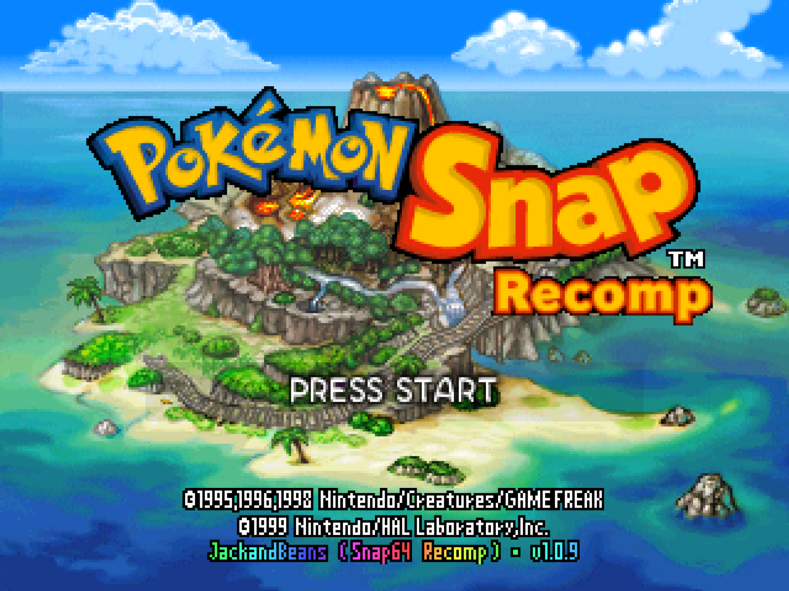</a>

**The title screen.** The game's own title with the port's "Recomp" wordmark
under it, the copyright block, and the port's credits line
(`JackandBeans (Snap64 Recomp) · v1.0.9`) set in the game's own lettering.
The same picture from each earlier release, `01-title.png` for 1.0.0 and
`01b` to `01i` for 1.0.1 to 1.0.8, stays in the folder for that release's
page.

**The title menu.** New Game, Continue, Gallery and Options are the game's;
**Snap Station**, the fifth entry, is the port's, drawn in the title's own
lettering. Like the Gallery entry above it, it is shown once the saved
report holds more than three species.

## A course

**Course select.** The island map with the seven courses down the left and
Oak's introduction to the one chosen.

**The Beach.** Surfing Pikachu riding its board along the shore at the
start of the first course, with the film counter top right and the item
buttons bottom right.

**The Tunnel.** Pikachu riding an Electrode.

**The Volcano.** Charizard's Flamethrower fills the frame.

**The Camera Check.** At the end of every course, before Oak's check, the
course's own tally: pictures, points,
kinds, the high score and the challenge score.

<a href="screenshots/04b-beach-widescreen.png">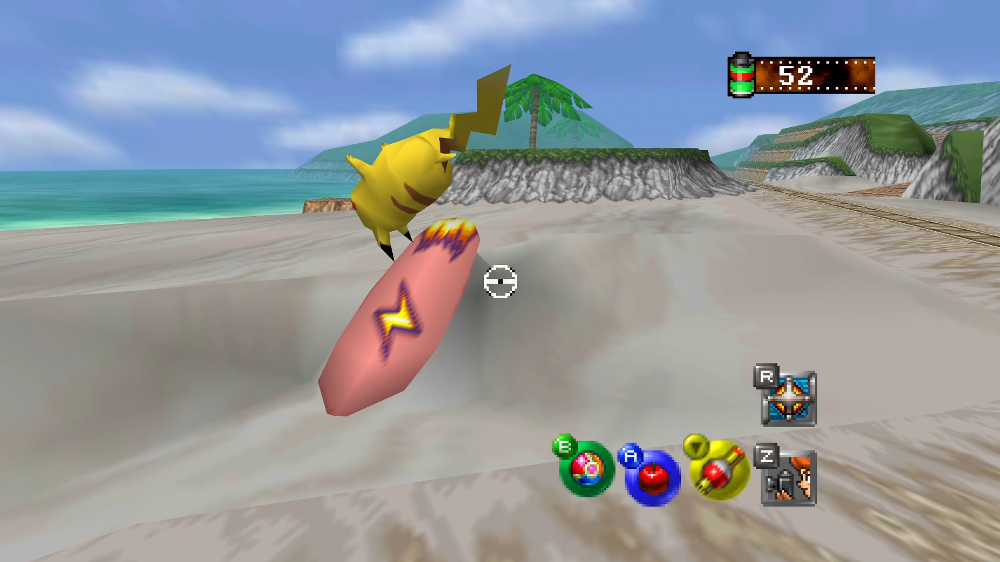</a>

**The Beach in Widescreen, 1.0.1.** Surfing Pikachu with Widescreen on, the
whole 16:9 frame rather than the 4:3 crop: the wider field of view the
renderer draws, with the Pokémon kept to its edges.

## The lab

**Oak's lab.** The hub between courses: Go to Course, the PKMN Report, the
PKMN Album, Save. The pale strip at the left edge of the translucent panel
is in the game's own backdrop picture; the console drew the same pixels.

## The port's pages

**Options.** The game's own Options screen, its rows at the cartridge's
own lines: Graphics, Controls and Exit Game are the port's entries, and
Sound opens the port's Sound page. The Z Button and Control Stick rows the
cartridge kept here live on the Controls page now. Exit Game asks once
(A again closes the program, B stays) and is how a pad quits.

**Graphics.** The port's page, set in the game's font and layout: Render
Scale, Super Sampling, Anti-Aliasing, Widescreen, Frame Rate, 2D Detail and
the rest, each with the game's style of help line. Every enhancement here is
off by default; Render Scale, 2D Detail and Filter start one setting from the
console's (README, "The rule the port follows").

**Sound.** Master, music, effects and shutter volumes, speaker output, and
Background Mute for when the window loses focus.

<a href="screenshots/10b-controls.png">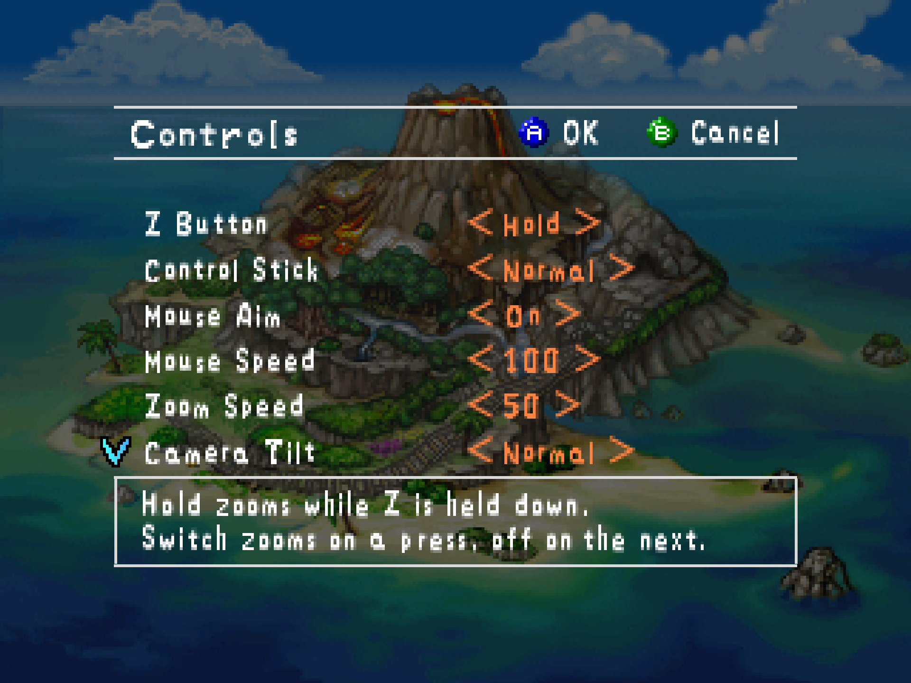</a>

**Controls.** Z Button and Control Stick, the game's own two settings,
then Mouse Aim, Mouse Speed, Zoom Speed, Camera Tilt, and below the edge
arrow, Gyro Aim and Gyro Speed: eight rows the page scrolls through six
at a time, the arrows swaying as the Graphics page's do.

<a href="screenshots/10c-controls-gyro.png">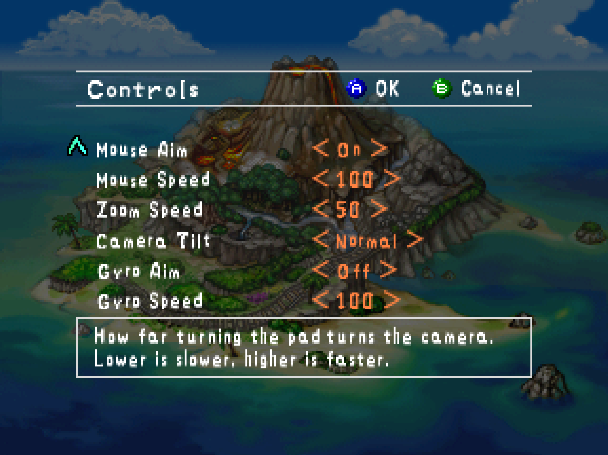</a>

**The Controls page, the gyro rows.** The same page scrolled to its lower
half: Mouse Aim and Mouse Speed, Zoom Speed, Camera Tilt, and Gyro Aim with
Gyro Speed, the help box explaining the row under the cursor.

<a href="screenshots/10d-controls-106.png">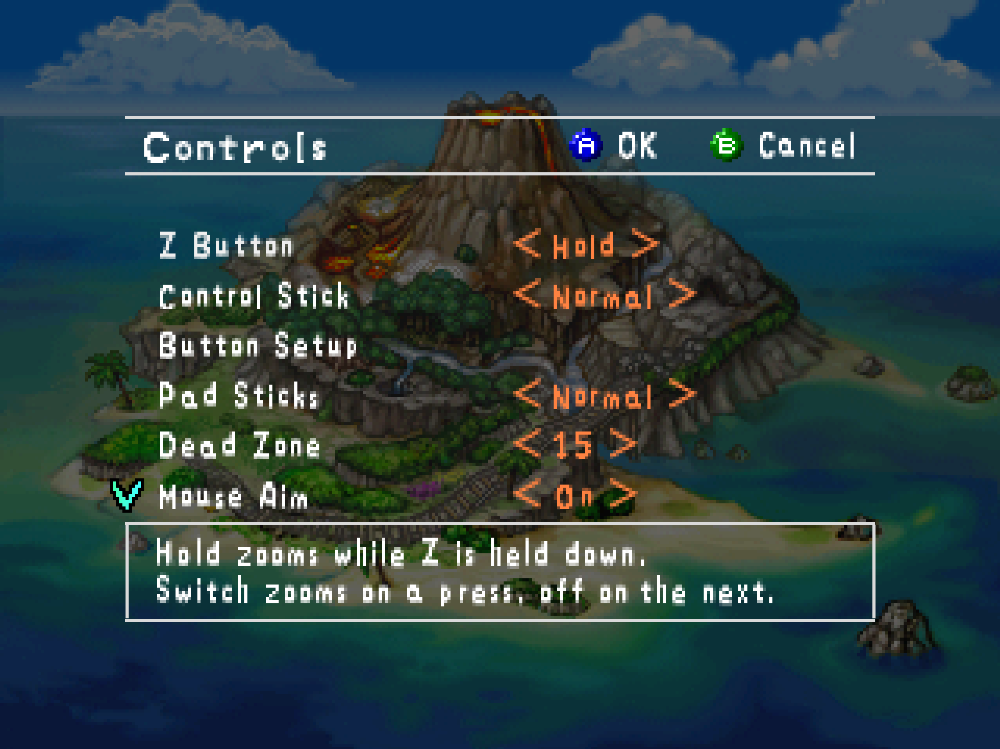</a>

**The Controls page, 1.0.6.** Eleven rows now: after Z Button and Control
Stick comes **Button Setup**, the row that opens the page below and carries
no value of its own, then **Pad Sticks** (Normal or Swapped) and **Dead
Zone** (0 to 40 in fives), then the mouse and gyro dials as before.

<a href="screenshots/10g-button-setup-107.png">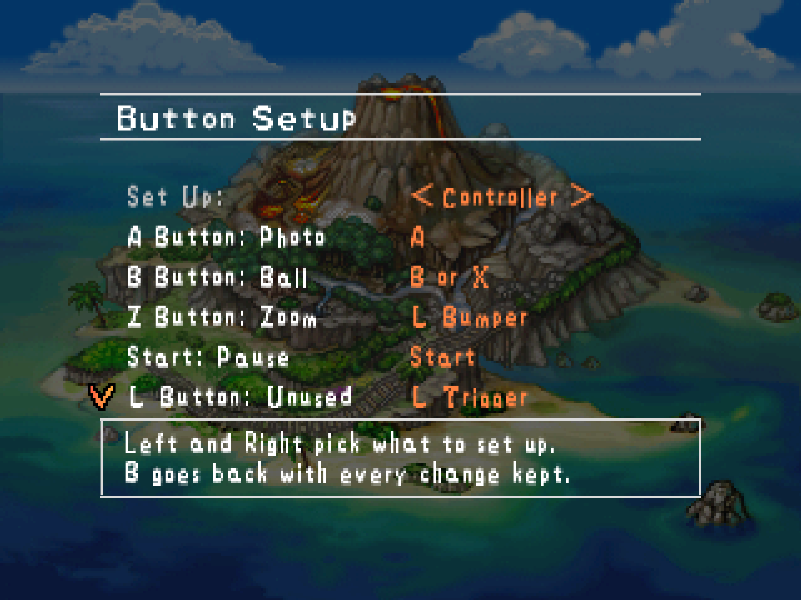</a>

**Button Setup, on a controller.** The page opens on the device attached,
here an Xbox pad: Set Up on the first row, then a row for each of the
game's inputs, named by its button and what it does, and what presses it
on that pad, five to a screen; the help box saying more about the row
under the cursor. A on a row listens for the next press; Z clears it.
(1.0.6's picture of this page, `10e-button-setup.png`, had Restore
Defaults second.)

<a href="screenshots/10i-button-setup-restore-107.png">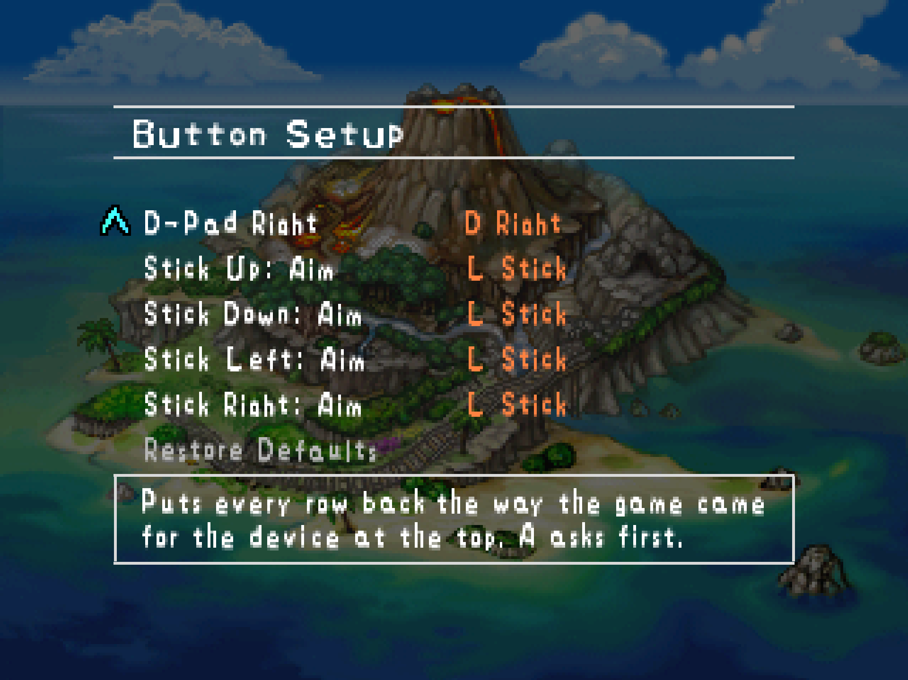</a>

**Button Setup, the last rows.** The page scrolled to its end, one Up from
the top row: the stick's four directions, then Restore Defaults, which asks
for a second A before it puts the device at the top back the way it came.

<a href="screenshots/10h-button-setup-keyboard-107.png">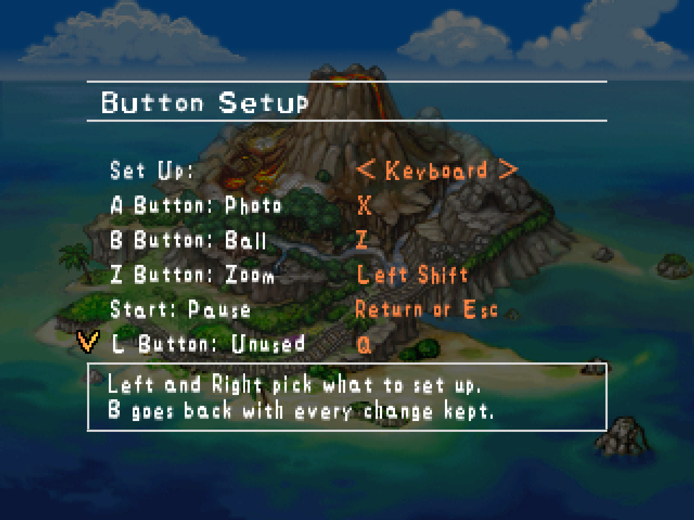</a>

**Button Setup, on the keyboard.** The same page with Set Up turned to
Keyboard: the shipped keys, and Esc beside Return on the Start row, since a
tap of Esc is Start whatever the table says.

<a href="screenshots/10j-controls-fast-108.png">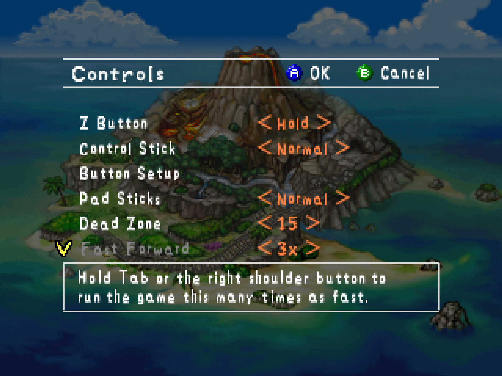</a>

**The Controls page, 1.0.8: Fast Forward.** Thirteen rows now. After Dead
Zone comes **Fast Forward**, the speed the game runs at while Tab or the
pad's right shoulder button is held: Off, 2x, 3x or 4x, 3x as shipped. The
help box says what the row does and what holds it.

<a href="screenshots/10k-controls-slow-108.png">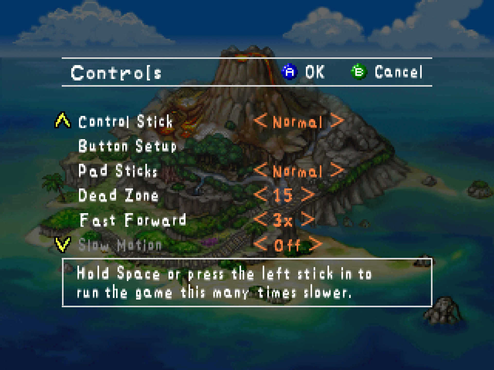</a>

**The Controls page, 1.0.8: Slow Motion.** The page scrolled one row to
its seventh, **Slow Motion**, the same thing run the other way: Off as
shipped, 2x or 4x slower while Space, or the left stick pressed in, is held.

<a href="screenshots/20-pause-options-109.png">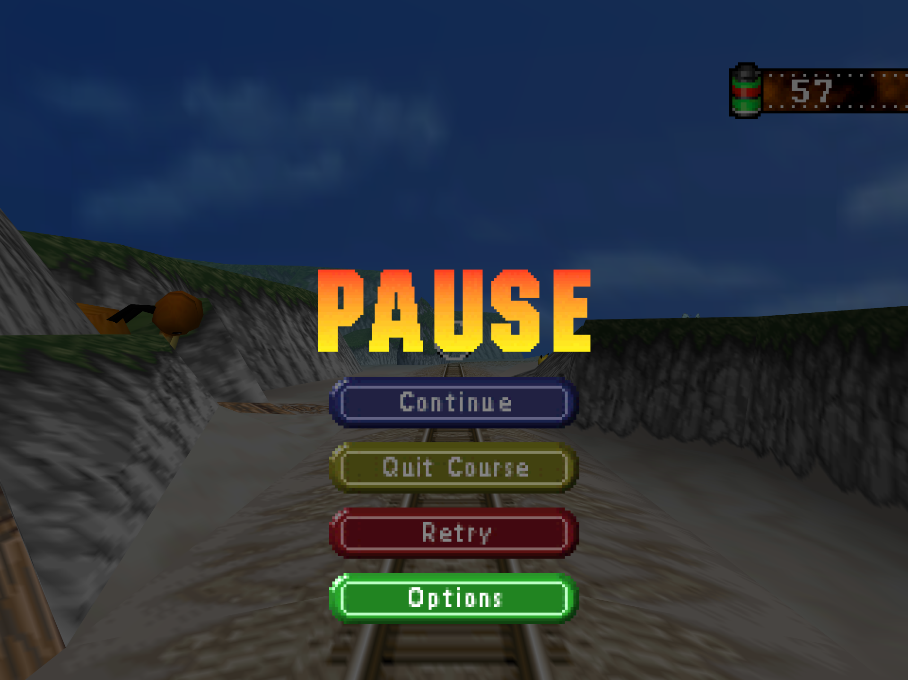</a>

**The pause menu, 1.0.9: Options.** A fourth pill under Retry, in green,
the one colour of the set the menu did not use. It is composed from the
game's own pill artwork and lettering, and it opens the port's pages over
the paused ride; Esc, or Select on a pad, opens them from any screen.

## The Snap Station

**The Gallery with the station attached.** The Print button the kiosk
showed, above Save, with the game's own help text about a print credit. The
four photos are the print tray.

**The printer's display.** Once the game had shown all sixteen sticker
slots, the kiosk's printer showed the grid it had collected under
"PRINTING... PLEASE WAIT", with three marks top right.

**Three stars.** The marks became stars one by one as the printer's three
passes finished; then the port relaunched itself into a normal boot, as the
kiosk reset its console. The display is composed from the port's own
captures. Its lettering is set from Roboto, since the printer's own typeface
cannot be read off a recording.

## Oak's check

**Prof. Oak's Check.** The card that opens the evaluation after a course.

**Choosing a photo.** The roll from the course; one picture per Pokémon
goes to Oak.

**The photo, close.** Oak with the chosen Pikachu. The photo is the game's
own re-render of the saved shot; the score is counted from that render.

**The score.** Size, pose, technique and the special bonus, last time and
this time.

**The evaluation.** Kinds of Pokémon in the report and the report score,
saved to the PKMN Report.
