# Screenshots

All nineteen, in the order a session meets them. Every one was taken from the
1.0.0 build at 1440p with Render Scale and Anti-Aliasing both at 8x on the
game's Graphics page, then cropped to the game's picture. They are frames of
Pokémon Snap as the port renders it, and the game is Nintendo's, Creatures',
GAME FREAK's and HAL Laboratory's (`NOTICE.md`); the README shows eight of
them.

## The title

**The title screen.** The game's own title with the port's "Recomp" wordmark
under it, the copyright block, and the port's credits line
(`JackandBeans (Snap64 Recomp) · v1.0.0`) set in the game's own lettering.

<a href="screenshots/02-title-menu.png">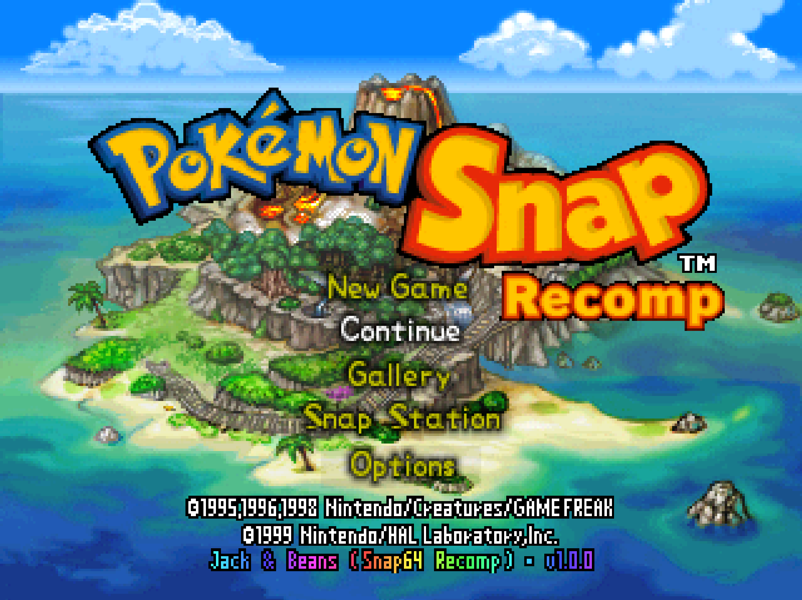</a>

**The title menu.** New Game, Continue, Gallery and Options are the game's;
**Snap Station**, the fifth entry, is the port's, drawn in the title's own
face and shown once the saved report holds more than three species, like
the Gallery entry above it.

## A course

<a href="screenshots/03-course-select.png">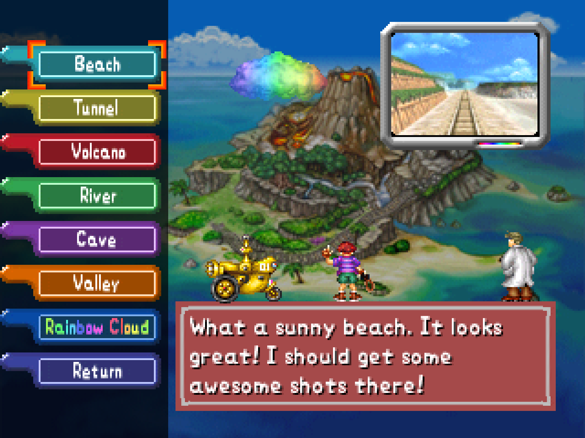</a>

**Course select.** The island map with the seven courses down the left and
Oak's introduction to the one chosen.

**The Beach.** Pikachu on the sand at the start of the first course, with
the film counter top right and the item buttons bottom right.

<a href="screenshots/05-tunnel.png">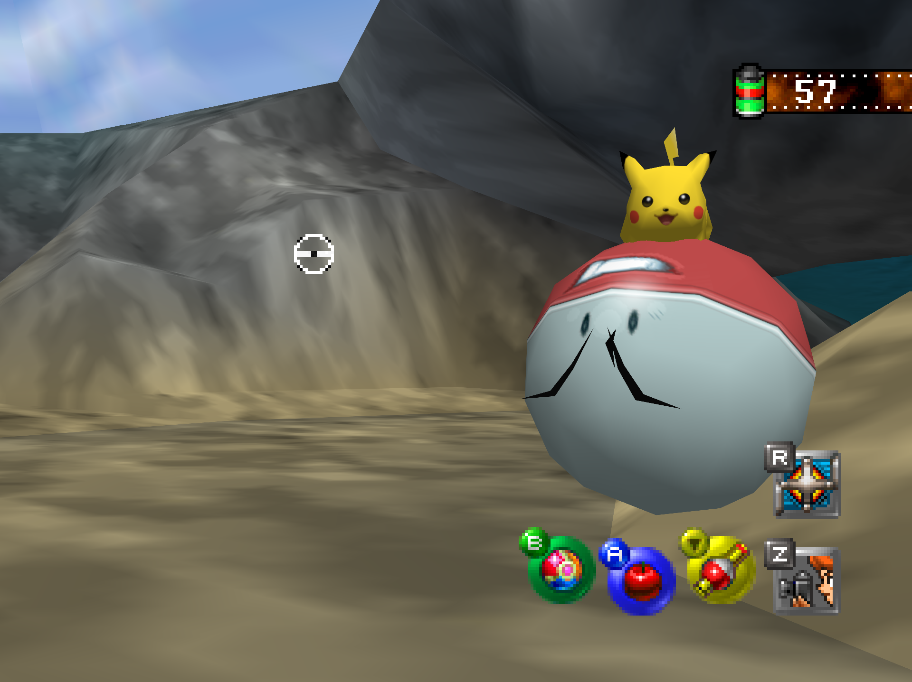</a>

**The Tunnel.** Pikachu riding an Electrode.

**The Volcano.** Charizard's Flamethrower fills the frame.

## The lab

<a href="screenshots/07-lab.png">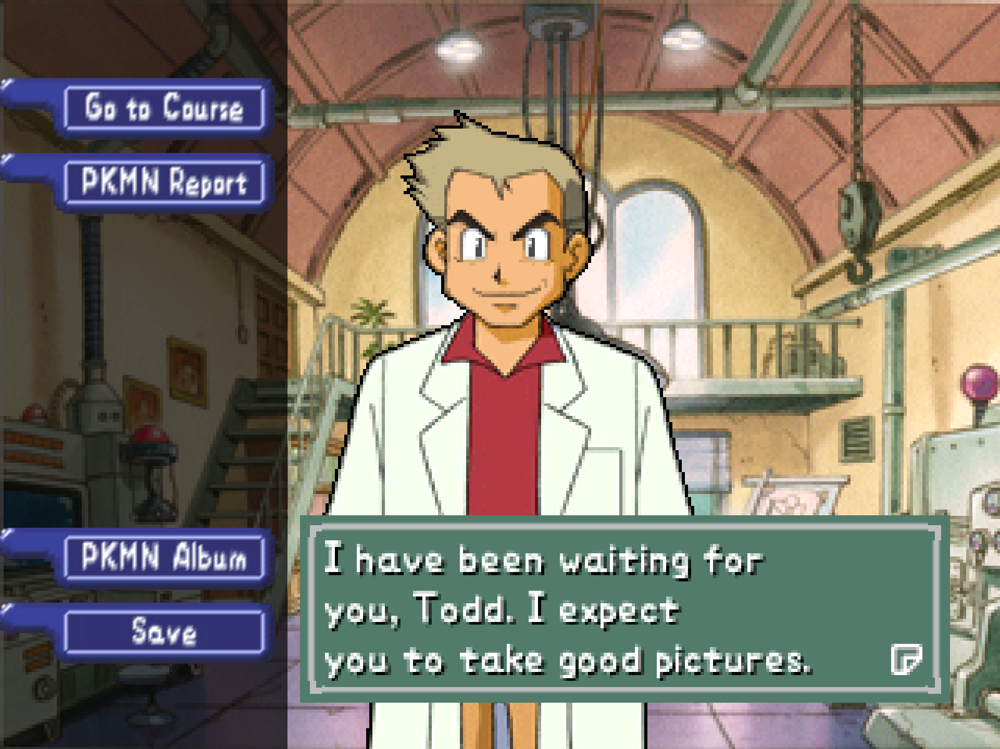</a>

**Oak's lab.** The hub between courses: Go to Course, the PKMN Report, the
PKMN Album, Save. The pale strip at the left edge of the translucent panel
is in the game's own backdrop picture; the console drew the same pixels.

## The port's pages

<a href="screenshots/08-options.png">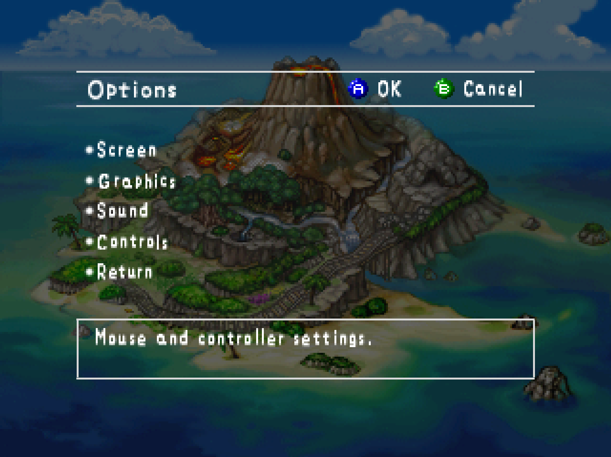</a>

**Options.** The game's own Options screen; Graphics is the port's entry,
and Sound opens the port's Sound page.

**Graphics.** The port's page, set in the game's font and layout: Render
Scale, Super Sampling, Anti-Aliasing, Widescreen, Frame Rate, 2D Detail and
the rest, each with the game's style of help line. Everything here defaults
to the console's behaviour.

<a href="screenshots/10-sound.png">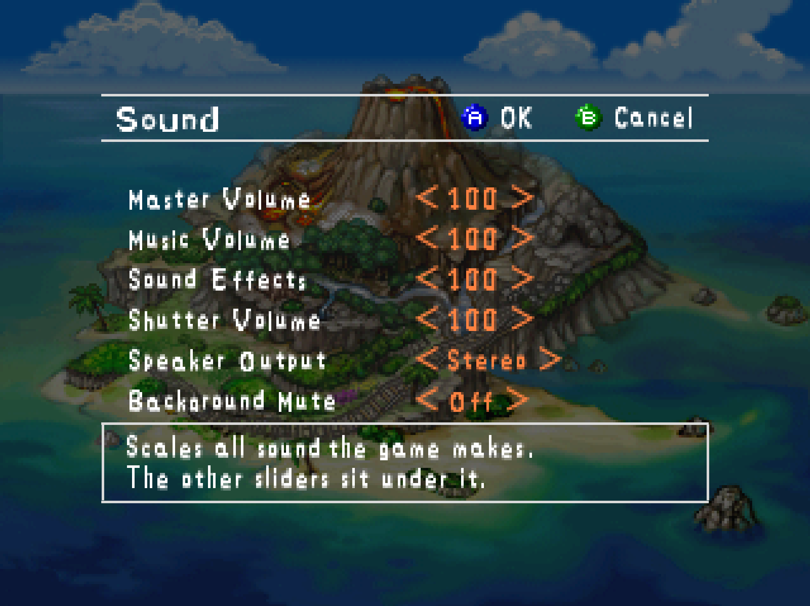</a>

**Sound.** Master, music, effects and shutter volumes, speaker output, and
Background Mute for when the window loses focus.

## The Snap Station

**The Gallery with the station attached.** The Print button the kiosk
showed, above Save, with the game's own help text about a print credit. The
four photos are the print tray.

<a href="screenshots/12-printer-marks.png">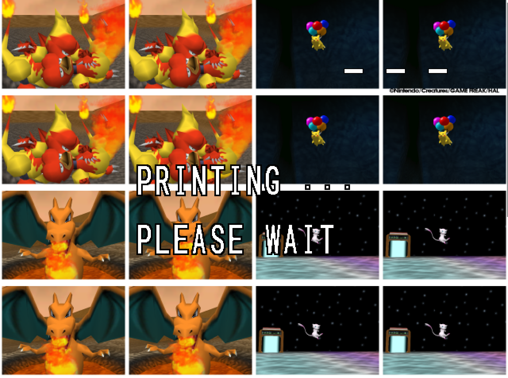</a>

**The printer's display.** After the sixteen slots the kiosk's printer
showed the sticker grid it had collected under "PRINTING... PLEASE WAIT",
with three marks top right.

**Three stars.** The marks became stars one by one as the printer's three
passes finished; then the console reset into a normal boot, as the kiosk
did. The display is composed from the port's own captures; its lettering is
set from Roboto, since the printer's face cannot be read off a recording.

## Oak's check

<a href="screenshots/14-oak-check.png">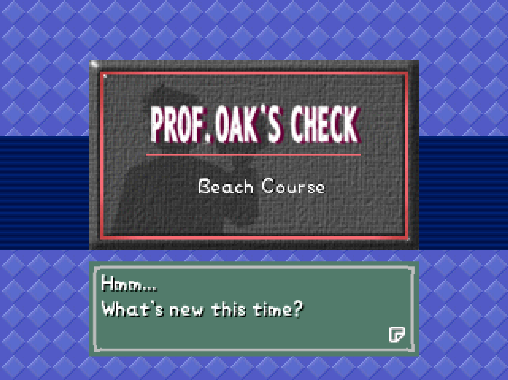</a>

**Prof. Oak's Check.** The card that opens the evaluation after a course.

<a href="screenshots/15-oak-check-photo.png">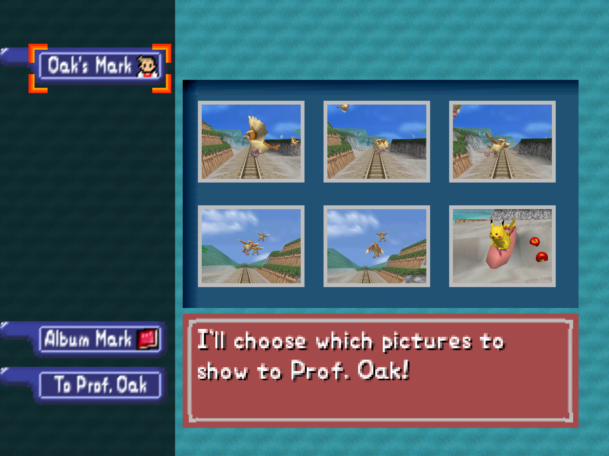</a>

**Choosing a photo.** The roll from the course; one picture per Pokémon
goes to Oak.

<a href="screenshots/16-oak-check-close.png">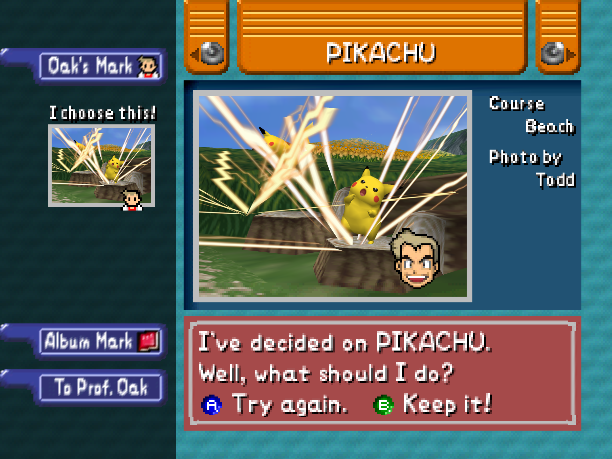</a>

**The photo, close.** Oak with the chosen Pikachu; the photo is the game's
own re-render of the saved shot, which is how it scores.

<a href="screenshots/17-oak-check-score.png">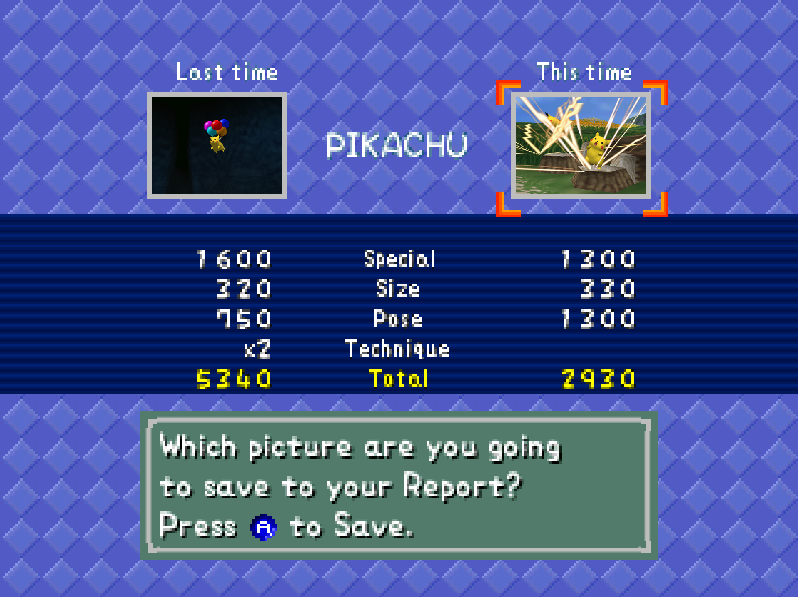</a>

**The score.** Size, pose, technique and the special bonus, last time and
this time.

<a href="screenshots/18-oak-check-total.png">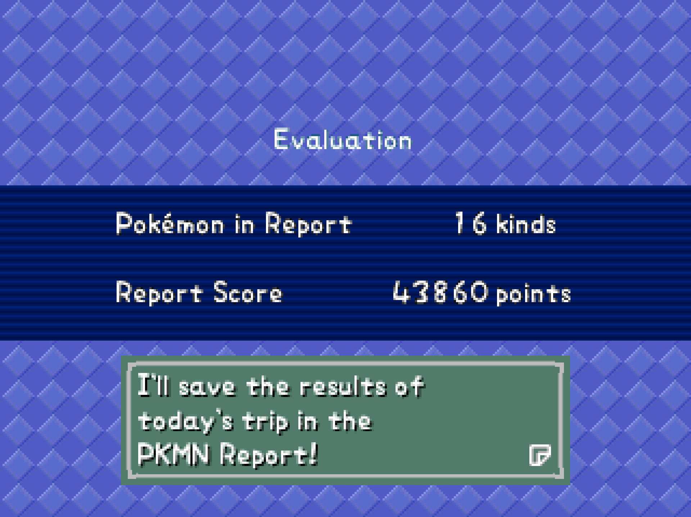</a>

**The evaluation.** Kinds of Pokémon in the report and the report score,
saved to the PKMN Report.

<a href="screenshots/19-course-end.png">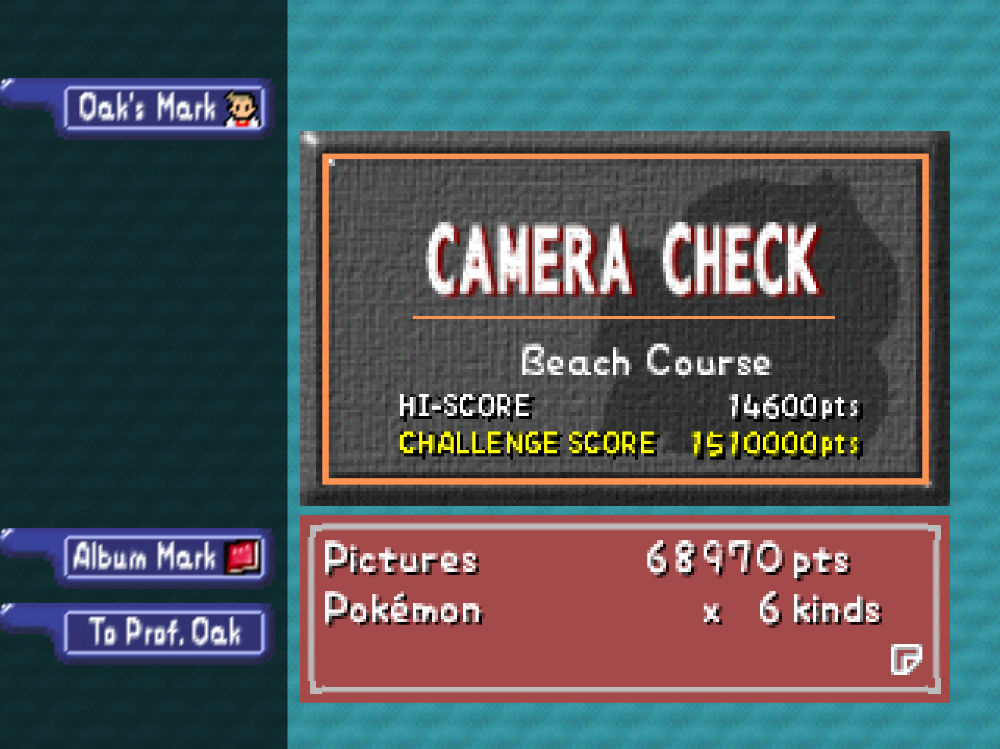</a>

**The Camera Check.** The course's own tally before Oak: pictures, points,
kinds, the high score and the challenge score.
