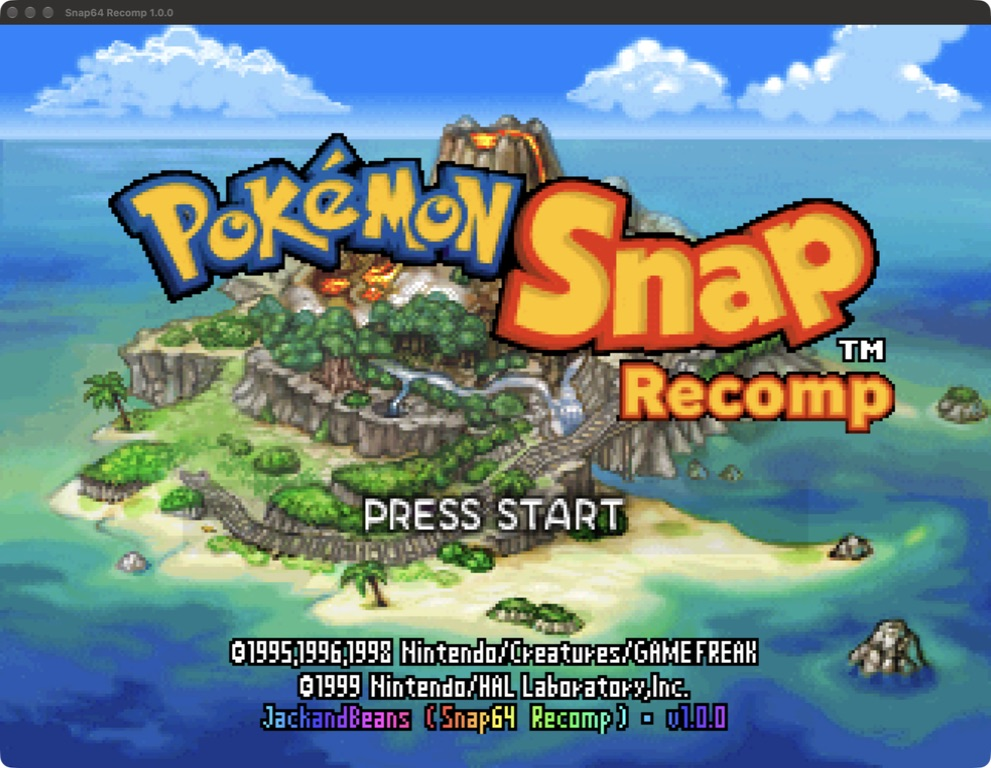
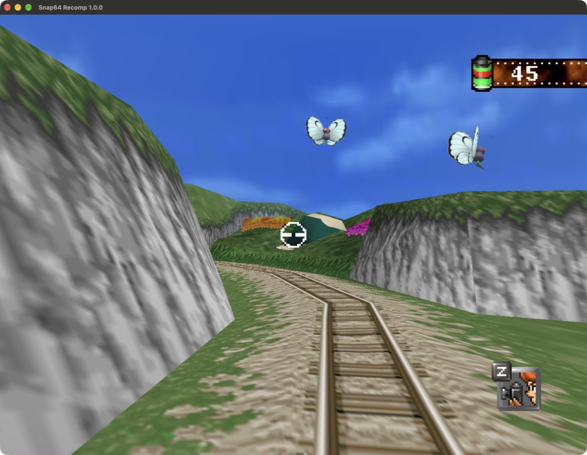
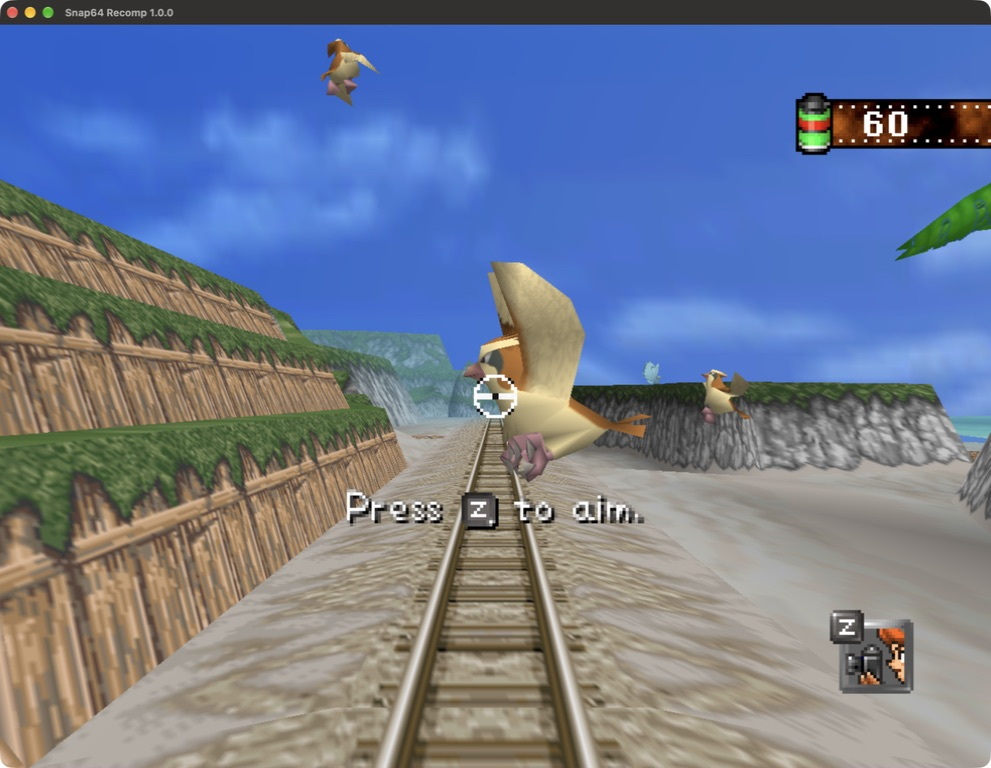
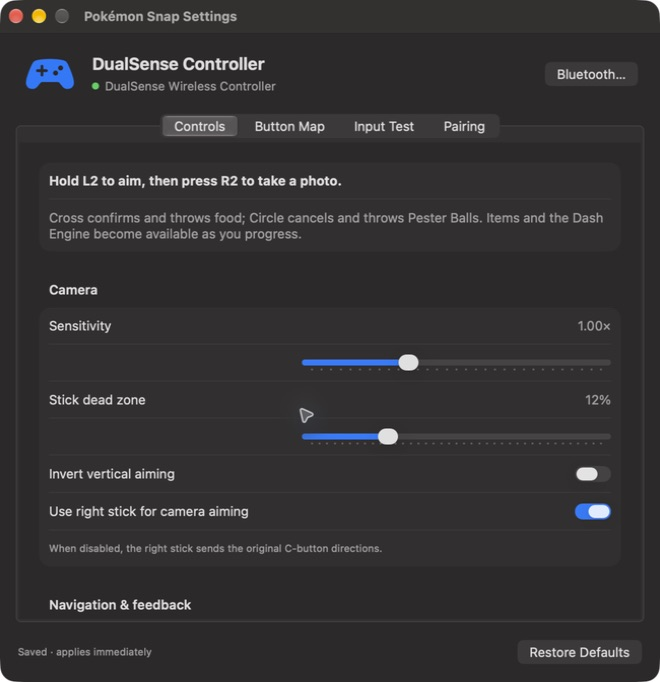
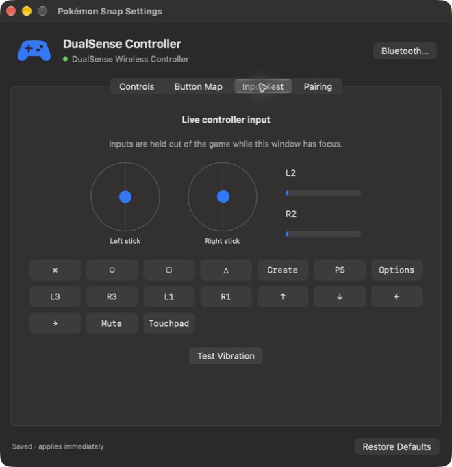

# Pokémon Snap on macOS

Native Apple Silicon build of [JackandBeans/Snap64Recomp](https://github.com/JackandBeans/Snap64Recomp), with RT64's Metal renderer, a custom macOS icon, and a SwiftUI controller settings window. The original game's code is statically recompiled to ARM64; this is not a Windows compatibility wrapper.

## Build from your own ROM

Requirements: an Apple Silicon Mac, macOS 14 or newer, full Xcode with the Metal Toolchain, Git, CMake, Ninja, Python 3, uv, Rust/Cargo, and `mips-linux-gnu-binutils`. Development and runtime checks were performed on an M3 Pro with macOS 27 beta and Xcode beta; the macOS 14 deployment target has not been tested on an older OS or an Intel Mac.

With Homebrew already installed:

```sh
brew install cmake ninja uv rust mips-linux-gnu-binutils
xcodebuild -downloadComponent MetalToolchain
./macos/script/prepare.sh '/path/to/Pokemon Snap (USA).z64'
./macos/script/build_and_run.sh --build-only
open "$HOME/Applications/Pokemon Snap.app"
```

Use the original big-endian USA cartridge dump, SHA-1 `edc7c49cc568c045fe48be0d18011c30f393cbaf`. The preparation helper checks the hash, fetches the pinned upstream dependencies, sets up the decompilation at `3a236dc20cd7f34dea188ef8bc33a31154f0ee97`, builds the native recompilers and SPIRV-Cross, and regenerates the game and patches. It downloads the decomp project's IDO tools and installs the pinned pigment64 asset utility. Allow several GB of disk space and time for the first build.

The package is locally ad-hoc signed. It is not notarized, and no downloadable binary release is provided here. ROMs, extracted assets, translated game sources, saves, downloaded dependencies, and build products stay in ignored local paths. The app bundle excludes the ROM; the build helper installs a private runtime copy into `~/Library/Application Support/Snap64 Recomp/` if one is not already present. Saves, preferences, cache, and logs also live there.

`--build-only` packages without launching. The default bundle location is outside synced Documents/Desktop folders, whose file-provider metadata can interfere with code signing. An existing game session is never terminated automatically. Quit it before opening the updated app. For subsequent game regeneration, use `./macos/script/regenerate_game.sh`; for ordinary host/UI edits, rerun the build helper.

The helpers create a checkout-specific symlink under `/tmp` because some vendor build rules cannot handle spaces or parentheses. The toolchain lives in `.macos-work/`, native objects in `build-macos/`, and the bundle in `~/Applications/Pokemon Snap.app` (override with `SNAP_APP_PATH`). The current consolidated build was checked using the already-prepared ROM/dependency inputs; the complete preparation helper has not yet been exercised from an empty machine.

For isolated diagnostic replays, set `SNAP_DATA_DIR` to an absolute directory containing a private ROM copy, then launch the bundle executable directly with `SNAP_REPLAY` pointing to an upstream recording in `tools/replays/`. This keeps replay saves and preferences separate from the normal game profile.

## Controller settings

Open **Pokémon Snap → Settings…**, press **⌘,**, or click the DualSense touchpad. There is one Settings menu entry. The window provides camera sensitivity, radial dead zone, vertical inversion, D-pad navigation, right-stick aiming, vibration preferences, a button reference, live input testing, and Bluetooth pairing guidance. Changes apply immediately and are saved atomically to `controller.json`. Inputs while the settings window has focus are suppressed in the game.

For Bluetooth, hold **Create + PS** until the controller light flashes, then select it in macOS Bluetooth settings. The app uses SDL's PS5 HIDAPI support for USB and Bluetooth. The PS button remains a macOS system control. See [Apple's pairing instructions](https://support.apple.com/en-us/111100).

| DualSense control | macOS game mapping |
| --- | --- |
| L2 | Hold to aim (N64 Z) |
| R2 / Cross | Take a photo while aiming; confirm / throw food otherwise (A) |
| Circle / Square | Cancel / Pester Ball (B) |
| Triangle | Poké Flute (C-down) |
| L1 / R1 | Quick turn left / right (C-left / C-right) |
| L3 | Dash Engine (R) |
| R3 | Turn around (C-up) |
| Options | Start / pause |
| D-pad | D-pad plus analog menu navigation by default |
| Left stick | Aim / analog navigation |
| Right stick | Aim by default; optionally original C-button directions |
| Create | Export photo when supported by the game screen |
| Touchpad click | Native Settings window |
| Mute | Toggle game audio when SDL exposes this button |

Items and the Dash Engine follow the original progression unlocks. The stronger of the two sticks controls aiming. These host input conveniences do not change the cartridge's game logic. Windows retains its original controller mapping.

Keyboard controls remain **WASD** for the analog stick, **X** for A, **Z** for B, **left Shift** to aim, and **Return** for Start. Arrow keys are the original D-pad. The name-entry grid uses **WASD + X**; direct letter typing and D-pad arrows do not move its analog cursor. **IJKL** are the C buttons, **Q/E** are L/R, **F11** toggles fullscreen, and **Escape** quits.

## Runtime screenshots

These are captures of the running macOS app, not generated mockups. Gameplay capture uses a local controller-input replay in an isolated fresh profile; the game still renders in real time. Game imagery belongs to the original rights holders. The icon is custom artwork; its generation prompt is in [macos/assets/ICON_PROMPT.md](../../macos/assets/ICON_PROMPT.md).











## Validation and limits

- Fresh native ARM64 Release build, strict ad-hoc bundle signature verification, and local app bundle launch on Apple M3 Pro; Metal renderer initialization confirmed in the runtime log.
- Rebuilt source ROM matched the original SHA-1. Intro, title, name entry, and in-course rendering were inspected live.
- A physical DualSense was detected in the app. Automated virtual SDL controller checks cover triggers, face buttons, shoulders, stick clicks, navigation, aiming, preference persistence/validation, and disconnects. Run `./macos/script/test_controllers.sh` after building.
- Duplicate Settings menu removed; the single menu entry and Command-comma opening the native window were checked live.
- No claim of a complete course/evaluation/save-reload cycle, all physical buttons, vibration feel, adaptive triggers, or haptic audio verification.
- The Windows `tools/release_check.py` suite expects `Snap64Recomp.exe` and Windows packaging checks. It has not been ported or run for this macOS build. No Windows regression build was performed.

The port also adds a guard for a VI tick before mode initialization and disables strict aliasing for translated code: the game mixes word and halfword accesses in emulated RAM, which otherwise caused a startup audio crash with optimizing Clang. Metal window/layer creation, macOS filesystem paths, native shader tooling, and platform compiler/linker handling are included.

Upstream authorship, GPLv3 licensing, and [third-party notices](../../NOTICE.md) are preserved. The macOS implementation and custom icon were developed with OpenAI Codex and its image-generation tool; these changes are an unofficial contribution, not an endorsement by the original project or game rights holders.
